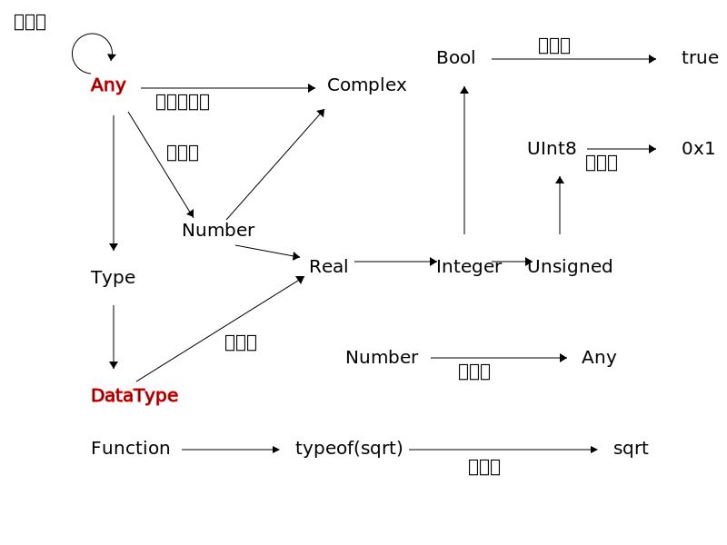

# 类型系统
## 预览
「类型」分为**抽象类型**和**实际类型**，它们通过**子类型**关系形成类似于[树](@todo)的结构，其中叶子节点即对应实际类型。

**实际类型**可以通过**构造函数**的实例化得到**值**，通过**赋值**行为与**辨识符**绑定成为**量**（包括**常量**与**变量**），值组成的**表达式**通过**求值**行为得到值。

一些说明：
- 对任意一个类型，它本身是 `Type` 的子类型（`DataType`、`Union`、`UnionAll`）之一的实例
- `Any` 是 `Any` 的子类型
- 与**子类型**相反的概念是**超类型**
- [函数](../basic/function.md)是 `Function` 的子类型的实例 [^3]
- 量的类型指当时所绑定的值的类型
- **在一些语境下，类型不视作量**



## 特色
通常，我们把程序语言中的类型系统划分成两类：静态类型和动态类型。对于静态类型系统，在程序运行之前，我们就可计算每一个表达式的类型。而对于动态类型系统，我们只有通过运行那个程序，得到表达式具体的值，才能确定其具体的类型。通过让编写的代码无需在编译时知道值的确切类型，面向对象允许静态类型语言具有一定的灵活性。可以编写在不同类型上都能运行的代码的能力被称为多态。在经典的动态类型语言中，所有的代码都是多态的，这意味着这些代码对于其中值的类型没有约束，除非在代码中去具体的判断一个值的类型，或者对对象做一些它不支持的操作。

Julia 类型系统是动态的，但由于允许指出某些变量具有特定类型，因此占有静态类型系统的一些优势。这对于生成高效的代码非常有帮助，但更重要的是，它允许针对函数参数类型的方法派发与语言深度集成。方法派发将在[方法](method.md)中详细探讨，但它根植于此处提供的类型系统。

在类型被省略时，Julia 的默认行为是允许值为任何类型。因此，可以编写许多有用的 Julia 函数，而无需显式使用类型。然而，当需要额外的表达力时，很容易逐渐将显式的类型注释引入先前的「无类型」代码中。添加类型注释主要有三个目的：利用 Julia 强大的多重派发机制、提高代码可读性以及捕获程序错误。

用[类型系统](https://zh.wikipedia.org/wiki/类型系统)的术语描述，Julia 是动态（dynamic）、主格（nominative）和参数（parametric）的。泛型可以被参数化，并且类型之间的层次关系可以被[显式地声明](https://en.wikipedia.org/wiki/Nominal_type_system)，而不是[隐含地通过兼容的结构](https://en.wikipedia.org/wiki/Structural_type_system)。Julia 类型系统的一个特别显著的特征是具体类型相互之间不能是子类型：所有具体类型都是最终的，并且超类只能是抽象类型。虽然这乍一看可能过于严格，但它有许多益处，且缺点却少得出奇。事实证明，能够继承行为比继承结构更重要，同时继承两者在传统的面向对象语言中导致了重大困难。Julia 类型系统的其它高级方面应当在先言明：
* 对象值和非对象值之间没有分别：Julia 中的所有值都是具有类型的真实对象且其类型属于一个单独的、完全连通的类型图，该类型图的所有节点作为类型一样都是头等的。
* 「编译期类型」是没有任何意义的概念：变量所具有的唯一类型是程序运行时的实际类型。这在面向对象被称为「运行时类型」，其中静态编译和多态的组合使得这种区别变得显著。
* 只有值，而不是变量，有类型——变量只是绑定到值的名称，尽管为了简单起见，我们可以说“变量的类型”作为“变量所引用的值的类型”的简写。  
* 抽象类型和具体类型都可以通过其它类型进行参数化。它们的参数化还可通过符号、使得 `isbits` 返回 `true` 的任意类型的值（实质上，也就是像数字或布尔变量这样的东西，存储方式像 C 类型或不包含指向其它对象的指针的 `struct`）和其元组。类型参数在不需要被引用或限制时可以省略。

Julia 的类型系统设计得强大而富有表现力，却清晰、直观且不引人注目。许多 Julia 程序员可能从未感觉需要编写明确使用类型的代码。但是，某些场景的编程可通过声明类型变得更加清晰、简单、快速和稳健。

## 类型声明
`::` 运算符可以用来在程序中给表达式和变量附加类型注释。这有两个主要原因：
1. 作为断言，帮助程序确认能是否正常运行，
2. 给编译器提供额外的类型信息，在一些情况下这可以提升程序性能。
    
置于到计算值的表达式后面时，`::` 操作符读作「是······的实例（is an instance of）」。在任何地方都可以用它来断言左侧表达式的值是右侧类型的实例。当右侧类型是具体类型时，左侧的值必须能够以该类型作为其实现——回想一下，所有具体类型都是最终的，因此没有任何实现是任何其它具体类型的子类型。当右侧类型是抽象类型时，值是由该抽象类型子类型中的某个具体类型实现的才能满足该断言。如果类型断言非真，抛出一个异常，否则返回左侧的值：
```julia-repl
julia> (1+2)::AbstractFloat
ERROR: TypeError: in typeassert, expected AbstractFloat, got a value of type Int64

julia> (1+2)::Int
3
```

这将允许**类型断言（type-assert）**作用在任意表达式上。
置于赋值语句左侧的变量之后，或作为 `local` 声明的一部分时，`::` 操作符的意义有所不同：它声明变量始终具有指定的类型，就像静态类型语言（如 C）中的类型声明。每个被赋给该变量的值都将使用 [`convert`](conpro.md) 转换为被声明的类型：

```julia-repl
julia> function foo()
       x::Int8 = 100
       x
       end
foo (generic function with 1 method)

julia> x = foo()
100

julia> typeof(x)
Int8
```

这个特性对避免特定的性能「陷阱」很有帮助，比如给一个变量赋值时意外地更改了其类型。\
此「声明」行为仅发生在特定上下文中：

```jl
local x::Int8
x::Int8 = 10
```

并应用于整个当前作用域，甚至在该声明之前。目前，类型声明不能在全局作用域中使用，例如在 REPL 中就不可以，因为 Julia 还没有常量类型的全局变量。\
声明也可以附加到函数定义：

```jl
function sinc(x)::Float64
    if x == 0
        return 1
    end
    return sin(pi*x)/(pi*x)
end
```

从函数返回时就如同给一个已被声明类型的变量赋值：返回值始终会被转换为`Float64`
!!! note
	Julia < 1.8.0 不支持对全局变量进行类型标注

## 抽象类型
抽象类型不能实例化，只能作为类型图中的节点使用，从而描述相关具体类型的集，即那些作为其后代的具体类型。即便抽象类型没有实例， 由于它们是类型系统的主干，故我们首先从抽象类型谈起：抽象类型形成了概念的层次结构，这使得 Julia 的类型系统不只是对象实现的集合。

回想一下，在[整数](../basic/int.md)和[浮点数](../basic/float.md)中，我们介绍了各种数值的具体类型：`Int8`、`UInt8`、`Int16`、`UInt16`、`Int32`、`UInt32`、`Int64`、`UInt64`、`Int128`、`UInt128`、`Float16`、`Float32` 和 `Float64`

尽管 `Int8`、`Int16`、`Int32`、`Int64` 和 `Int128` 具有不同的表示大小，但都具有共同的特征，即它们都是带符号的整数类型。类似地，`UInt8`、`UInt16`、`UInt32`、`UInt64` 和 `UInt128` 都是无符号整数类型，而 `Float16`、`Float32` 和 `Float64` 是不同的浮点数类型而非整数类型。

一段代码只对某些类型有意义是很常见的，比如，只在其参数是某种类型的整数，而不真正取决于特定*类型*的整数时有意义。例如，最大公约数适用于所有类型的整数，但不适用于浮点数。抽象类型允许构造类型的层次结构，这给具体类型提供了可以适应的环境。例如，你可以轻松地为任何类型的整数编程，而不用将算法限制为某种特殊类型的整数。。

抽象类型可以由 `abstract type` 关键字来声明。声明抽象类型的一般语法是：
```jl
abstract type «名称» end
abstract type «名称» <: «上级抽象类型» end
```

该 `abstract type` 关键字引入了一个新的抽象类型，`«名称»` 为其名称。此名称后面可以跟`<:`和一个已存在的类型，表示新声明的抽象类型是此「上级」类型的子类型。

如果没有给出超类型，则默认超类型为 `Any`——一个已经定义好的抽象类型，所有对象都是 `Any` 的实例并且所有类型都是 `Any` 的子类型。在类型理论中，`Any` 通常称为「top」，因为它位于类型图的顶点。Julia 还有一个预定义了的抽象「bottom」类型，在类型图的最低点，写成 `Union{}`。这与 `Any` 完全相反：任何对象都不是 `Union{}` 的实例，所有的类型都是 `Union{}` 的超类型。

让我们考虑[一些构成 Julia 数值类型层次结构的抽象类型](../lists/typetree1.6.txt#L795-L820)

`Number` 类型为 `Any` 类型的直接子类型，并且 `Real` 为它的子类型。接下来，`Real` 有子类型 `Integer` 和`AbstractFloat`，将世界分为整数的表示和实数的表示。实数的表示当然包括浮点类型，但也包括其他类型，例如有理数。因此，`AbstractFloat` 是一个 `Real` 的子类型，仅包括实数的浮点表示。整数被进一步细分为 `Signed` 和 `Unsigned`

`<:` 运算符的通常意义为「是······的子类型（is a subtype of）」，可以用在声明中，声明右侧类型是新声明类型的直接超类型；也可以在表达式中用作子类型运算符，在其左操作数为其右操作数的子类型时返回 `true`
```julia-repl
julia> Integer <: Number
true

julia> Integer <: AbstractFloat
false
```

抽象类型的一个重要用途是为具体类型提供默认实现。例如：
```jl
myplus(x, y) = x + y
```

首先需要注意的是上述的参数声明等价于 `x::Any, y::Any`。当函数被调用时，例如 `myplus(2,5)`，派发器会选择与给定参数相匹配的名称为 `myplus` 的最具体方法（有关多重派发的更多信息，请参阅[方法](method.md)）。

假设没有找到比上述方法更具体的方法，Julia 则会基于上面给出的泛型函数，在内部定义并编译一个名为 `myplus` 的方法，专门用于处理两个 `Int` 参数，即它隐式地定义并编译：
```jl
myplus(x::Int, y::Int) = x + y
```

最后，调用这个具体的方法。

因此，抽象类型允许程序员编写泛型函数，泛型函数可以通过许多具体类型的组合用作默认方法。多重派发使得程序员可以完全控制是使用默认方法还是更具体的方法。

需要注意的重点是，即使程序员依赖参数为抽象类型的函数，性能也不会有任何损失，因为它会针对每个调用它的参数元组的具体类型重新编译。（但在函数参数是抽象类型的容器的情况下，可能存在性能问题；请参阅[性能建议](https://docs.juliacn.com/latest/manual/performance-tips)）

## 原始类型
!!! warning
	通常情况下更建议在新的复合类型中封装现有的原始类型，而不是重新定义自己的原始类型。
	这个功能的存在是为了允许 Julia 能引导受 LLVM 支持的标准基本类型。一旦一些标准类型被定义，就不需要再定义更多了。

原始类型是具体类型，其数据是由简单的位组成。原始类型的经典示例是整数和浮点数。与大多数语言不同，Julia 允许你声明自己的原始类型，而不是只提供一组固定的内置原始类型。实际上，标准原始类型都是在语言本身中定义的：

```jl
primitive type Bool <: Integer 8 end
primitive type Char <: AbstractChar 32 end
primitive type Int8 <: Signed 8 end
primitive type UInt8 <: Unsigned 8 end
...
```

声明原始类型的一般语法是：
```jl
primitive type «名称» «位数» end
primitive type «名称» <: «上级抽象类型» «位数» end
```

同样地，如果省略超类型，则默认 `Any` 为其直接超类型
!!! note
	当前「位数」只能是 8 的倍数，否则会遇到 LLVM 的 bug

`Bool`，`Int8` 和 `UInt8` 类型都具有相同的表现形式：它们都是 8 位内存块。然而，由于 Julia 的类型系统是主格的，它们尽管具有相同的结构，但不是通用的。它们之间的一个根本区别是它们具有不同的超类型。

## 复合类型
复合类型在各种语言中被称为 `record`、`struct`、`object`、`class` 等等。复合类型是命名字段的集合，其实例可以视为单个值。复合类型在许多语言中是唯一一种用户可定义的类型，也是 Julia 中最常用的用户定义类型。

在主流的面向对象语言（如 C++、Java、Python、Ruby 中）复合类型也具有与它们相关的命名函数，并且该组合称为「对象」。在纯粹的面向对象语言（如 Ruby、Smalltalk）中所有值都是对象，无论它们是否为复合类型。在不太纯粹的面向对象语言中，包括 C++ 和 Java，一些值，比如整数和浮点值，不是对象，而用户定义的复合类型是具有相关方法的真实对象。

在 Julia 中，所有值都是对象，但函数不与它们操作的对象捆绑在一起。这是必要的，因为 Julia 通过多重派发选择函数使用的方法，这意味着在选择方法时考虑*所有*函数参数的类型，而不仅仅是第一个（有关方法和派发的更多信息，请参阅[方法](method.md)）。因此，函数仅仅「属于」它们的第一个参数是不合适的。将方法组织到函数对象中而不是在每个对象「内部」命名方法最终成为语言设计中一个非常有益的方面。

复合类型可以是**可变**（mutable）或**不可变**（immutable）的，相关详细信息在[一个单独章节](struct.md)中

## 已声明的类型
前面章节中讨论的三种类型（抽象、原始、复合）实际上都是密切相关的。它们共有相同的关键属性：
* 都是显式声明的
* 都具有名称
* 都已经显式声明超类型
* 可以有参数

由于这些共有属性，它们在内部表现为 `DataType` 的实例
```julia-repl
julia> typeof(Real)
DataType

julia> typeof(Int)
DataType
```

`DataType` 可以是抽象的或具体的。它如果是具体的，就具有指定的大小、存储布局和字段名称（可选）。因此，原始类型是具有非零大小的 `DataType`，但没有字段名称。复合类型是具有字段名称或者为空（大小为零）的 `DataType`。

## 类型共用体
类型共用体是一种特殊的抽象类型，它包含作为对象的任何参数类型的所有实例，使用特殊关键字构造，我们已在[basic](../basic/little_types.md#共用)中提过\
许多语言都有内建的共用体结构来推导类型；Julia 简单地将它暴露给程序员。Julia 编译器能在 `Union` 类型只具有少量类型[^1]的情况下生成高效的代码，方法是为每个可能类型的不同分支都生成专用代码。

`Union` 类型的一种特别有用的情况是 `Union{T, Nothing}`，其中 `T` 可以是任何类型，`Nothing` 是单态类型，其唯一实例是对象`nothing`。此模式是其它语言中 `Nullable`、`Option` 或 `Maybe` 类型在 Julia 的等价。通过将函数参数或字段声明为 `Union{T, Nothing}`，可以将其设置为类型为 `T` 的值，或者 `nothing` 来表示没有值 [区分missing、nothing和undef](../basic/little_types.md#missing-nothing-undef的区分)

## 参数类型
Julia 类型系统的一个重要和强大的特征是它是参数的：类型可以接受参数，因此类型声明实际上引入了一整套新类型——每一个参数值的可能组合引入一个新类型。许多语言支持某种版本的[泛型编程](https://en.wikipedia.org/wiki/Generic_programming)，其中，可以指定操作泛型的数据结构和算法，而无需指定所涉及的确切类型。例如，某些形式的泛型编程存在于 ML、Haskell、Ada、Eiffel、C++、Java、C#、F#、和 Scala 中，这只是其中的一些例子。这些语言中的一些支持真正的参数多态（例如 ML、Haskell、Scala），而其它语言基于模板的泛型编程风格（例如 C++、Java）。由于在不同语言中有多种不同种类的泛型编程和参数类型，我们甚至不会尝试将 Julia 的参数类型与其它语言的进行比较，而是专注于解释 Julia 系统本身。然而，我们将注意到，因为 Julia 是动态类型语言并且不需要在编译时做出所有类型决定，所以许多在静态参数类型系统中遇到的传统困难可以被相对容易地处理。

所有已声明的类型（`DataType` 类型的实例）都可被参数化，在每种情况下都使用相同的语法

### 参数复合类型
类型参数在类型名称后引入，用大括号括起来：
```jl
struct Point{T}
	x::T
	y::T
end
```

此声明定义了一个新的参数类型，`Point{T}`，拥有类型为 `T` 的两个「坐标」。有人可能会问 `T` 是什么？嗯，这恰恰是参数类型的重点：它可以是任何类型（或者任何位类型值，虽然它实际上在这里显然用作类型）。`Point{Float64}` 是一个具体类型，该类型等价于通过用`Float64`替换 `Point` 的定义中的 `T` 所定义的类型。因此，单独这一个声明实际上声明了无限个类型：`Point{Float64}`，`Point{AbstractString}`，`Point{Int64}`，等等。这些类型中的每一个类型现在都是可用的具体类型：
```julia-repl
julia> Point{Float64}
Point{Float64}

julia> Point{AbstractString}
Point{AbstractString}
```

`Point{Float64}` 类型是坐标为 64 位浮点值的点，而 `Point{AbstractString}` 类型是「坐标」为字符串的「点」\
`Point` 本身也是一个有效的类型对象，包括所有实例 `Point{Float64}`、`Point{AbstractString}` 等作为子类型
```julia-repl
julia> Point{Float64} <: Point
true

julia> Point{AbstractString} <: Point
true
```

当然，其他类型不是它的子类型：
```julia-repl
julia> Float64 <: Point
false

julia> AbstractString <: Point
false
```

`Point` 不同 `T` 值所声明的具体类型之间，不能互相作为子类型：
```julia-repl
julia> Point{Float64} <: Point{Int64}
false

julia> Point{Float64} <: Point{Real}
false
```

!!! warning
    最后一点*非常*重要：即使 `Float64 <: Real` 也**没有** `Point{Float64} <: Point{Real}`

换成类型理论说法，Julia 的类型参数是*不变的*，而不是[协变的（或甚至是逆变的）](https://en.wikipedia.org/wiki/Covariance_and_contravariance_%28computer_science%29)。这是出于实际原因：虽然任何 `Point{Float64}` 的实例在概念上也可能像是 `Point{Real}` 的实例，但这两种类型在内存中有不同的表示：
* `Point{Float64}` 的实例可以紧凑而高效地表示为一对 64 位立即数；
* `Point{Real}` 的实例必须能够保存任何一对`Real`的实例。由于 `Real` 实例的对象可以具有任意的大小和结构，`Point{Real}` 的实例实际上必须表示为一对指向单独分配的 `Real` 对象的指针

在数组的情况下，能够以立即数存储 `Point{Float64}` 对象会极大地提高效率：`Array{Float64}` 可以存储为一段 64 位浮点值组成的连续内存块，而 `Array{Real}` 必须是一个由指向单独分配的`Real`的指针组成的数组——这可能是 [boxed](https://en.wikipedia.org/wiki/Object_type_%28object-oriented_programming%29#Boxing) 64 位浮点值，但也可能是任意庞大和复杂的对象，且其被声明为 `Real` 抽象类型的表示\
由于 `Point{Float64}` 不是 `Point{Real}` 的子类型，下面的方法不适用于类型为 `Point{Float64}` 的参数：
```jl
function norm(p::Point{Real})
	sqrt(p.x^2 + p.y^2)
end
```

一种正确的方法来定义一个接受类型的所有参数的方法，`Point{T}`其中`T`是一个子类型`Real`
```jl
function norm(p::Point{<:Real})
    sqrt(p.x^2 + p.y^2)
end
```

!!! note
	也可以使用`function norm(p::Point{T} where T<:Real)` 或 `function norm(p::Point{T}) where T<:Real` 定义，参考[UnionAll](#unionall)

稍后将在[方法](method.md)中讨论更多示例。

如何构造一个 `Point` 对象？可以为复合类型定义自定义的构造函数，这会在[构造函数](struct.md#构造函数)中详细讨论

### 参数抽象类型
参数抽象类型声明以非常相似的方式声明了一族抽象类型
```julia-repl
julia> abstract type Pointy{T} end
```

在此声明中，对于每个类型或整数值 `T`，`Pointy{T}` 都是不同的抽象类型。与参数复合类型一样，每个此类型的实例都是 `Pointy` 的子类型：
```julia-repl
julia> Pointy{Int64} <: Pointy
true
julia> Pointy{1} <: Pointy
true
```

参数抽象类型是不变的，就像参数复合类型
```julia-repl
julia> Pointy{Float64} <: Pointy{Real}
false
julia> Pointy{Real} <: Pointy{Float64}
false
```

符号 `Pointy{<:Real}` 可用于表示*协变*类型的 Julia 类似物，而 `Pointy{>:Int}` 类似于*逆变*类型，但从技术上讲，它们都代表了类型的*集合*（参见[UnionAll](#unionall)）
```julia-repl
julia> Pointy{Float64} <: Pointy{<:Real}
true
julia> Pointy{Real} <: Pointy{>:Int}
true
```

正如之前的普通抽象类型用于在具体类型上创建实用的类型层次结构一样，参数抽象类型在参数复合类型上具有相同的用途。例如，我们可以将 `Point{T}` 声明为 `Pointy{T}` 的子类型，如下所示：
```jl
struct Point{T} <: Pointy{T}
	x::T
	y::T
end
```

鉴于此类声明，对每个 `T`，都有 `Point{T}` 是 `Pointy{T}` 的子类型：
```julia-repl
julia> Point{Float64} <: Pointy{Float64}
true

julia> Point{Real} <: Pointy{Real}
true

julia> Point{AbstractString} <: Pointy{AbstractString}
true
```

下面的关系依然不变：
```julia-repl
julia> Point{Float64} <: Pointy{Real}
false
julia> Point{Float64} <: Pointy{<:Real}
true
```

参数抽象类型（比如 `Pointy`）的用途是什么？考虑一下如果点都在对角线 *x = y* 上，那我们创建的点的实现可以只有一个坐标：
```jl
struct DiagPoint{T} <: Pointy{T}
	x::T
end
```

现在，`Point{Float64}` 和 `DiagPoint{Float64}` 都是抽象 `Pointy{Float64}` 的实现，每个类型 `T` 的其它可能选择与之类似。这允许对被所有 `Pointy` 对象共享的公共接口进行编程，接口都由 `Point` 和 `DiagPoint` 实现。它的真正意义体现在下一章。

有时，类型参数取遍所有可能类型也许是无意义的。在这种情况下，可以像这样约束 `T` 的范围：
```julia-repl
julia> abstract type Pointy{T<:Real} end

julia> Pointy{AbstractString}
ERROR: TypeError: in Pointy, in T, expected T<:Real, got Type{AbstractString}

julia> Pointy{1}
ERROR: TypeError: in Pointy, in T, expected T<:Real, got a value of type Int64
```

参数化复合类型的类型参数可用相同的方式限制：
```jl
struct Point{T<:Real} <: Pointy{T}
    x::T
    y::T
end
```

这里给出了一个真实示例（`Rational`，用来表示有理数），展示了所有这些参数类型机制如何发挥作用
```jl
struct Rational{T<:Integer} <: Real
    num::T
    den::T
end
```

只有接受整数值的比例才是有意义的，因此参数类型 `T` 被限制为 `Integer` 的子类型，又整数的比例代表实数轴上的值，因此是抽象类型`Real`的子类型

### 元组类型
元组类型是函数参数的抽象化——不带函数本身。函数参数的突出特征是它们的顺序和类型。因此，元组类型类似于参数化的不可变类型，其中每个参数都是一个字段的类型，它的格式已在[语法基础](../basic/little_types.md#元组)中提过（也提到了 `Vararg` 和 `NTuple`），同时需要注意：
* 元组类型可以具有任意数量的参数
* 元组类型的参数是协变的（covariant）：`Tuple{Int}` 是 `Tuple{Any}` 的子类型。因此，`Tuple{Any}` 被认为是一种抽象类型，且元组类型只有在它们的参数都是具体类型时才是具体类型。
* 元组没有字段名称，字段只能通过索引访问。

请注意协变性的含义：
```julia-repl
julia> Tuple{Int,AbstractString} <: Tuple{Real,Any}
true

julia> Tuple{Int,AbstractString} <: Tuple{Real,Real}
false

julia> Tuple{Int,AbstractString} <: Tuple{Real,}
false
```

直观地，这对应于函数参数的类型是函数签名（当函数签名匹配时）的子类型。

### 具名元组类型
具名元组是 `NamedTuple` 类型的实例，该类型有两个参数：一个给出字段名称的符号元组和一个给出字段类型的元组类型
```julia-repl
julia> typeof((a=1,b="hello"))
NamedTuple{(:a, :b), Tuple{Int64, String}}
```

`@NamedTuple` 宏提供了类结构体（`struct`）的具名元组（`NamedTuple`）声明，使用 `键::类型` 的语法，如果省略 `::类型` 则默认为 `::Any`。

```julia-repl
julia> @NamedTuple{a::Int, b::String}
NamedTuple{(:a, :b), Tuple{Int64, String}}

julia> @NamedTuple begin
           a::Int
           b::String
       end
NamedTuple{(:a, :b), Tuple{Int64, String}}
```

`NamedTuple` 类型可以用作构造函数，接受一个单独的元组作为参数。构造出来的 `NamedTuple` 类型可以是具体类型，如果参数都被指定，也可以是只由字段名称所指定的类型：
```julia-repl
julia> @NamedTuple{a::Float32,b::String}((1,""))
(a = 1.0f0, b = "")

julia> NamedTuple{(:a, :b)}((1,""))
(a = 1, b = "")
```

如果指定了字段类型，参数会被转换，否则就直接使用参数的类型。

类似于元组，具名元组在 Julia 1.7 之后允许进行属性解构：
```julia-repl
julia> nt = (a=1, b=2)
(a = 1, b = 2)

julia> let
           (; a, b) = nt
           a, b
       end
(1, 2)
```

### 参数原始类型
原始类型也可以参数化声明，例如，指针都能表示为原始类型，其在 Julia 中以如下方式声明：
```jl
# 32-bit
primitive type Ptr{T} 32 end
# 64-bit
primitive type Ptr{T} 64 end
```

与典型的参数复合类型相比，此声明中略显奇怪的特点是类型参数 `T` 并未在类型本身的定义里使用——它实际上只是一个抽象的标记，定义了一整族具有相同结构的类型，类型间仅由它们的类型参数来区分。因此，`Ptr{Float64}` 和 `Ptr{Int64}` 是不同的类型，就算它们具有相同的表示。当然，所有特定的指针类型都是总类型 `Ptr`的子类型
```julia-repl
julia> Ptr{Float64} <: Ptr
true
julia> Ptr{Int64} <: Ptr
true
```

## UnionAll
我们已经说过，像 `Ptr` 这样的参数类型可充当它所有实例（`Ptr{Int64}` 等）的超类型。这是如何办到的？`Ptr` 本身不能是普通的数据类型，因为在不知道引用数据的类型时，该类型显然不能用于存储器操作。答案是 `Ptr`（或其它参数类型，如`Vector`）是一种不同种类的类型，称为 `UnionAll`类型。这种类型表示某些参数的所有值的类型的*迭代并集*
```julia-repl
julia> typeof(Vector)
UnionAll

julia> typeof(Ptr)
UnionAll
```

`UnionAll` 类型通常使用关键字 `where` 编写。例如，`Ptr` 可以更精确地写为 `Ptr{T} where T`，也就是对于 `T` 的某些值，所有类型为 `Ptr{T}` 的值。在这种情况下，参数 `T` 也常被称为「类型变量」，因为它就像一个取值范围为类型的变量。每个 `where` 只引入一个类型变量，因此在具有多个参数的类型中这些表达式会被嵌套，例如 `Array{T,N} where N where T`

类型应用语法 `A{B,C}` 要求 `A` 是个 `UnionAll` 类型，并先代入 `B` 作为 `A` 中最外层的类型变量。结果应该是另一个 `UnionAll` 类型，然后再将 `C` 代入。所以 `A{B,C}` 等价于 `A{B}{C}`。这解释了为什么可以部分实例化一个类型，比如 `Array{Float64}`：第一个参数已经被固定，但第二个参数仍取遍所有可能值。通过使用 `where` 语法，任何参数子集都能被固定。例如，所有一维数组的类型可以写为 `Array{T,1} where T`

类型变量可以用子类型关系来加以限制。`Array{T} where T<:Integer` 指的是元素类型是某种`Integer`的所有数组。语法 `Array{<:Integer}` 是 `Array{T} where T<:Integer` 的便捷的缩写。类型变量可同时具有上下界。`Array{T} where Int<:T<:Number` 指的是元素类型为能够包含 `Int` 的`Number`的所有数组（因为 `T` 至少和 `Int` 一样大）。语法 `where T>:Int` 也能用来只指定类型变量的下界，且 `Array{>:Int}` 等价于 `Array{T} where T>:Int`

由于 `where` 表达式可以嵌套，类型变量界可以引用更外层的类型变量。比如 `Tuple{T,Array{S}} where S<:AbstractArray{T} where T<:Real` 指的是二元元组，其第一个元素是某个 `Real`，而第二个元素是数组的数组 `Array`，其包含的内部数组的元素类型由元组的第一个元素类型决定

`where` 关键字本身可以嵌套在更复杂的声明里。例如，考虑由以下声明创建的两个类型：

```julia-repl
julia> const T1 = Array{Array{T, 1} where T, 1}
Vector{Vector} (alias for Array{Array{T, 1} where T, 1})

julia> const T2 = Array{Array{T, 1}, 1} where T
Array{Vector{T}, 1} where T
```

类型 `T1` 定义了由一维数组组成的一维数组；每个内部数组由相同类型的对象组成，但此类型对于不同内部数组可以不同。另一方面，类型 `T2` 定义了由一维数组组成的一维数组，其中的每个内部数组必须具有相同的类型。请注意，`T2` 是个抽象类型，比如 `Array{Array{Int,1},1} <: T2`，而 `T1` 是个具体类型。因此，`T1` 可由零参数构造函数 `a=T1()` 构造，但 `T2` 不行。

命名此类型有一种方便的语法，类似于函数定义语法的简短形式：`Vector{T} = Array{T, 1}`

这等价于 `const Vector = Array{T,1} where T`。编写 `Vector{Float64}` 等价于编写 `Array{Float64,1}`，总类型 `Vector` 具有所有 `Array` 对象的实例，其中 `Array` 对象的第二个参数——数组维数——是 1，而不考虑元素类型是什么。在参数类型必须总被完整指定的语言中，这不是特别有用，但在 Julia 中，这允许只编写 `Vector` 来表示包含任何元素类型的所有一维密集数组的抽象类型。

## 类型选择器
对于每个类型 `T`，`Type{T}` 是一个抽象的参数类型，它的唯一实例是对象`T`。这个构造使得函数可以直接以类型为参数进行分派（如`typemax`）
```julia-repl
julia> isa(Float64, Type{Float64})
true

julia> isa(Real, Type{Float64})
false

julia> isa(Real, Type{Real})
true

julia> isa(Float64, Type{Real})
false
```

换句话说，`isa(A, Type{B})` 当且仅当 `A`、`B` 相等且为类型

特别地，由于参数类型是常量，我们有
```julia-repl
julia> struct TypeParamExample{T}
           x::T
       end

julia> TypeParamExample isa Type{TypeParamExample}
true

julia> TypeParamExample{Int} isa Type{TypeParamExample}
false

julia> TypeParamExample{Int} isa Type{TypeParamExample{Int}}
true
```

如果没有参数，`Type` 只是一个抽象类型，所有类型对象都是其实例（[Type 在类型层次结构中的位置](../lists/typetree1.6.txt#L1001-L1005)）
```julia-repl
julia> isa(Type{Float64}, Type)
true

julia> isa(Float64, Type)
true

julia> isa(Real, Type)
true

julia> isa(1, Type)
false

julia> isa("foo", Type)
false
```

虽然 `Type` 与任何其他抽象参数类型一样是 Julia 类型层次结构的一部分，但它并不常用在方法签名之外，除非在某些特殊情况下。 `Type` 的另一个重要用法是使不太精确的字段类型更加清晰，例如 `DataType` 在下面的示例中，默认构造函数可能会导致依赖精确包装类型的代码出现性能问题（类似于 抽象类型参数）
```julia-repl
julia> struct WrapType{T}
       value::T
       end

julia> WrapType(Float64)
WrapType{DataType}(Float64)

julia> WrapType(::Type{T}) where T = WrapType{Type{T}}(T)
WrapType

julia> WrapType(Float64)
WrapType{Type{Float64}}(Float64)
```

## 类型别名
有时为一个已经可表达的类型引入新名称是很方便的。这可通过一个简单的赋值语句完成。例如，`UInt`是`UInt32`与`UInt64`之一的别名，因为它的大小与系统上的指针大小是相适应的。
```julia-repl
julia> UInt # 32-bit
UInt32

julia> UInt # 64-bit
UInt64
```

这是由 `base/boot.jl` 中以下代码实现的：
```jl
if Int === Int64
    const UInt = UInt64
else
    const UInt = UInt32
end
```

当然，这依赖于 `Int` 的别名，但它被预定义成正确的类型
!!! note
	与 `Int` 不同，`Float` 不作为特定大小的别名而存在。与整数寄存器不同，浮点数寄存器大小由 IEEE-754 标准指定，而 `Int` 的大小反映了该机器上本地指针的大小

## 类型操作
因为 Julia 中的类型本身就是对象，所以一般的函数可以对它们进行操作。已经引入了一些对于使用或探索类型特别有用的函数，例如 `<:` 运算符，它表示其左操作数是否为其右操作数的子类型。

`isa`函数测试对象是否具有给定类型并返回 `true` 或 `false`
```julia-repl
julia> isa(1, Int)
true

julia> isa(1, AbstractFloat)
false
```

在文档示例中随处可见的`typeof`函数返回其参数的类型。如上所述，因为类型都是对象，所以它们也有类型，我们可以询问它们的类型：
```julia-repl
julia> typeof(Rational{Int})
DataType

julia> typeof(Union{Real,String})
Union

julia> typeof(DataType)
DataType

julia> typeof(Union)
DataType
```

另一个适用于某些类型的操作是`supertype`，它显示了类型的超类型。只有已声明的类型才有明确的超类型
```julia-repl
julia> supertype(Float64)
AbstractFloat

julia> supertype(Number)
Any

julia> supertype(Rational)
Real

julia> supertype(Union{Float64,Int64})
ERROR: MethodError: no method matching supertype(::Type{Union{Float64, Int64}})
```

## 自定义显示
通常，人们会想要自定义显示类型实例的方式。这可通过重载`show`函数来完成。举个例子，假设我们定义一个类型来表示极坐标形式的复数
```julia-repl
julia> struct Polar{T<:Real} <: Number
           r::T
           Θ::T
       end

julia> Polar(r::Real,Θ::Real) = Polar(promote(r,Θ)...)
Polar
```

在这里，我们添加了一个自定义的构造函数，这样就可以接受不同`Real`类型的参数并将它们类型提升为共同类型（当然，为了让它表现地像个`Number`，我们需要定义许多其它方法，例如 `+`、`*`、`one`、`zero` 及类型提升规则等）默认情况下，此类型的实例只是相当简单地显示有关类型名称和字段值的信息，比如，`Polar{Float64}(3.0,4.0)`。

如果我们希望它显示为 `3.0 * exp(4.0im)`，我们可定义以下方法来将对象打印到给定的输出对象 `io`（参阅[I/O](io.md)）
```jl
Base.show(io::IO, z::Polar) = print(io, z.r, " * exp(", z.Θ, "im)")
```

`Polar` 对象的输出可以被更精细地控制。特别是，人们有时想要啰嗦的多行打印格式，用于在 REPL 和其它交互式环境中显示单个对象，以及一个更紧凑的单行格式，用于`print`函数或在作为其它对象（比如一个数组）的部分是显示该对象。虽然在两种情况下默认都会调用 `show(io, z)` 函数，你仍可以定义一个*不同*的多行格式来显示单个对象，这通过重载三参数形式的 `show` 函数，该函数接收 `text/plain` MIME 类型（请参阅 [mime](mime.md)）作为它的第二个参数，例如：

```jl
Base.show(io::IO, ::MIME"text/plain", z::Polar{T}) where{T} = print(io, "Polar{$T} complex number:\n   ", z)
```

请注意 `print(..., z)` 在这里调用的是双参数的 `show(io, z)` 方法，这导致：

```julia-repl
julia> Polar(3, 4.0)
Polar{Float64} complex number:
   3.0 * exp(4.0im)

julia> [Polar(3, 4.0), Polar(4.0,5.3)]
2-element Vector{Polar{Float64}}:
 3.0 * exp(4.0im)
 4.0 * exp(5.3im)
```

其中单行格式的 `show(io, z)` 仍用于由 `Polar` 值组成的数组。从技术上讲，REPL 调用 `display(z)` 来显示单行的执行结果，其默认为 `show(stdout, MIME("text/plain"), z)`，而后者又默认为 `show(stdout, z)`，但是你*不应该*定义新的 `display` 方法，除非你正在定义新的多媒体显示管理器（[MIME](mime.md)）。

此外，你还可以为其它 MIME 类型定义 `show` 方法，以便在支持的环境（比如 IJulia）中实现更丰富的对象显示（HTML、图像等）。例如，我们可以定义 `Polar` 对象的 HTML 显示格式，使其带有上标和斜体：

```jl
Base.show(io::IO, ::MIME"text/html", z::Polar{T}) where {T} =
    println(io, "<code>Polar{$T}</code> complex number: ",
    z.r, " <i>e</i><sup>", z.Θ, " <i>i</i></sup>")
```

之后会在支持 HTML 显示的环境中自动使用 HTML 显示 `Polar` 对象，但你也可以手动调用 `show` 来获取 HTML 输出：
```julia-repl
julia> show(stdout, "text/html", Polar(3.0, 4.0))
<code>Polar{Float64}</code> complex number: 3.0 <i>e</i><sup>4.0 <i>i</i></sup>
```

展示结果：
<code>Polar{Float64}</code> complex number: 3.0 <i>e</i><sup>4.0 <i>i</i></sup><br />

根据经验，单行 `show` 方法应为创建的显示对象打印有效的 Julia 表达式。当这个 `show` 方法包含中缀运算符时，比如上面的 `Polar` 的单行 `show` 方法里的乘法运算符（`*`），在作为另一个对象的部分打印时，它可能无法被正确解析。要查看此问题，请考虑下面的表达式对象（请参阅[Expr](expr.md)），它代表 `Polar` 类型的特定实例的平方：
```julia-repl
julia> a = Polar(3, 4.0)
Polar{Float64} complex number:
   3.0 * exp(4.0im)

julia> print(:($a^2))
3.0 * exp(4.0im) ^ 2
```

因为运算符 `^` 的优先级高于 `*`（请参阅[运算符的优先级与结合性](https://docs.juliacn.com/latest/manual/mathematical-operations/#%E8%BF%90%E7%AE%97%E7%AC%A6%E7%9A%84%E4%BC%98%E5%85%88%E7%BA%A7%E4%B8%8E%E7%BB%93%E5%90%88%E6%80%A7)），所以此输出错误地表示了表达式 `a ^ 2`，而该表达式等价于 `(3.0 * exp(4.0im)) ^ 2`。为了解决这个问题，我们必须为 `Base.show_unquoted(io::IO, z::Polar, indent::Int, precedence::Int)` 创建一个自定义方法，在打印时，表达式对象会在内部调用它：
```julia-repl
julia> function Base.show_unquoted(io::IO, z::Polar, ::Int, precedence::Int)
           if Base.operator_precedence(:*) <= precedence
               print(io, "(")
               show(io, z)
               print(io, ")")
           else
               show(io, z)
           end
       end
julia> :($a^2)
:((3.0 * exp(4.0im)) ^ 2)
```

当正在调用的运算符的优先级大于等于乘法的优先级时，上面定义的方法会在 `show` 调用的两侧加上括号。这个检查允许，在没有括号时也可被正确解析的表达式（例如 `:($a + 2)` 和 `:($a == 2)`），在打印时省略括号：
```julia-repl
julia> :($a + 2)
:(3.0 * exp(4.0im) + 2)
julia> :($a == 2)
:(3.0 * exp(4.0im) == 2)
```

在某些情况下，根据上下文调整 `show` 方法的行为是很有用的。这可通过 `IOContext` 类型实现，它允许同时传递上下文属性和封装后的 IO 流。例如，我们可以在 `:compact` 属性设置为 `true` 时创建一个更短的表示，而在该属性为 `false` 或不存在时返回长的表示：
```jl
function Base.show(io::IO, z::Polar)
	if get(io, :compact, false)
		print(io, z.r, "ℯ", z.Θ, "im")
	else
		print(io, z.r, " * exp(", z.Θ, "im)")
	end
end
```

当传入的 IO 流是设置了 `:compact`（且值为 `true`）属性的 `IOContext` 对象时，新的紧凑表示将被使用。特别地，当打印具有多列的数组（由于水平空间有限）时就是这种情况：
```julia-repl
julia> show(IOContext(stdout, :compact=>true), Polar(3, 4.0))
3.0ℯ4.0im

julia> [Polar(3, 4.0) Polar(4.0,5.3)]
1×2 Matrix{Polar{Float64}}:
 3.0ℯ4.0im  4.0ℯ5.3im
```

有关调整打印效果的常用属性列表，请参阅文档 [`IOContext`](io.md#io上下文)

## 值类型
在 Julia 中，你无法根据诸如 `true` 或 `false` 之类的*值*进行分派。然而，你可以根据参数类型进行分派，Julia 允许你包含「plain bits」值（类型、符号、整数、浮点数和元组等）作为类型参数。`Array{T,N}` 里的维度参数就是一个常见的例子，在这里 `T` 是类型（比如`Float64`），而 `N` 只是个 `Int`。

你可以创建把值作为参数的自定义类型，并使用它们控制自定义类型的分派。为了说明这个想法，让我们引入参数类型 `Val{x}` 和构造函数 `Val(x) = Val{x}()`，在不需要更精细的层次结构时，这是利用此技巧的一种习惯的方式。

`Val` 的定义为
```julia-repl
julia> struct Val{x}
       end

julia> Val(x) = Val{x}()
Val
```

需注意的是，接受的参数 `T` 只能是 `Symbol` 或满足 `isbits(T)`

`Val` 的实现就只需要这些。一些 Julia 标准库里的函数接收 `Val` 的实例作为参数，你也可以使用它来编写你自己的函数，例如：
```julia-repl
julia> firstlast(::Val{true}) = "First"
firstlast (generic function with 1 method)

julia> firstlast(::Val{false}) = "Last"
firstlast (generic function with 2 methods)

julia> firstlast(Val(true))
"First"

julia> firstlast(Val(false))
"Last"
```

为了保证 Julia 的一致性，调用处应当始终传递 `Val` **实例** 而不是 **类型**，也就是使用 `foo(Val(:bar))` 而不是 `foo(Val{:bar})`

值得注意的是，参数「值」类型非常容易被误用，包括 `Val`；在不适用的情形下，你很容易使代码性能变得更*糟糕*。特别是，你可能永远都不会想要写出如上所示的代码。有关 `Val` 的正确（和不正确）使用的更多信息，请阅读[性能建议](https://docs.juliacn.com/latest/manual/performance-tips/#man-performance-value-type)中更广泛的讨论

## 相关函数
| 名称 | 描述 |
| --- | --- |
| `isabstracttype` | 是否是抽象类型 |
| `isconcretetype` | 是否是具体类型 |
| `isprimitivetype` | 是否是原始类型 |
| `isstructtype` | 是否是复合类型 |
| `ismutable` | 是否是可变类型 |
| `isimmutable` | 是否是不可不类型 |
| `isbitstype` | 是否是「[纯数据类型](ref.md#纯数据类型)」 |
| `isbits` | 是否是「纯数据类型」的实例 |
| `isa` | 前者是否是后者的实例 |
| `typeof` | 获取类型 |
| `typeintersect` | 获取两类型交集（常常是 `Union{}`） |
| `typejoin` | 获取两类型最近公共祖先 |
| `subtypes` | 获取指定 `DataType` 实例的子类型列表 |
| `supertype` | 获取指定类型的上级类型 |
| `supertypes` | 获取从指定类型向上直到 `Any` 的元组 |

## 类型层级关系
[这](../pieces/typetree.jl)是一个基于 `subtypes` 的类型列举工具
* [在 1.6.1 版本下对 `Any` 绘制得到的结果](../lists/typetree1.6.txt)
* [在 1.8.3 版本下对 `Any` 绘制得到的结果](../lists/typetree1.8.txt)

[^1]: 「少数」由常数 `MAX_UNION_SPLITTING` 定义，目前设置为 4
[^2]: https://docs.juliacn.com/latest/manual/types/
[^3]: https://discourse.juliacn.com/t/topic/941
