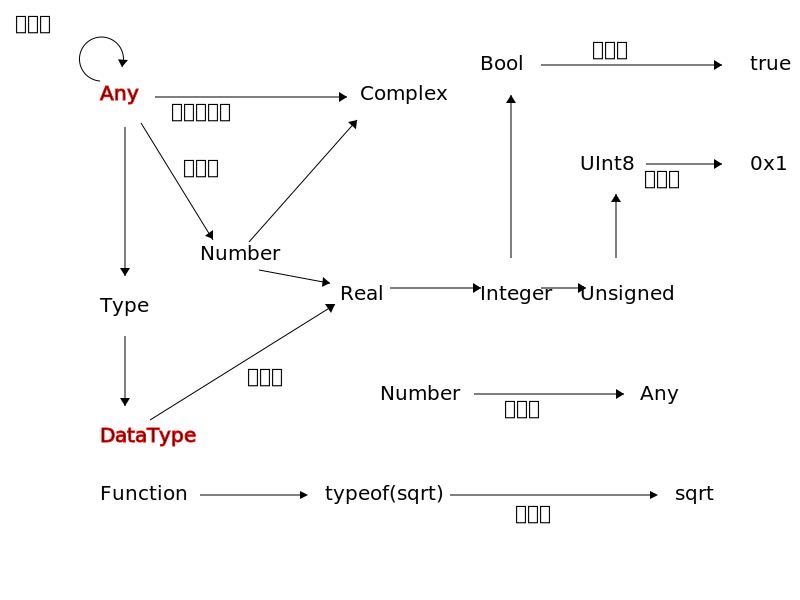

# 类型系统
## 概念
`类型(type)`分为`抽象类型(abstract type)`和`实际类型(concrete type)`，它们通过`子类型(subtype)`关系形成类似于[树](../algorithms/graph/tree.md)的结构，其中`叶子节点(leaf node)`对应实际类型\
实际类型通过`构造函数(constructor)`实例化，生成`值(value)`，通过`赋值(assign)`行为将值与`量`（包括`常量(constant)`与`变量(variable)`）绑定，值组成的`表达式(expression)`通过`求值(evaluate)`行为得到值



## 细节
- `类型`本身是`DataType`的实例
- `Any`是`Any`的子类型
- 子类型的逆运算是`超类型(supertype)`
- `function`关键字定义的函数是`Function`的子类型的实例
- 变量的类型指当时变量所绑定的值的类型
- 在一些语境下，类型不被视作量

## 抽象类型
抽象类型只能作为类型图中的节点使用，它们不能被实例化，但允许声明同名的函数
```jl
julia> abstract type Container end # 没有标注超类型时默认为Any

julia> abstract type AbstractBottle<:Container end
```

其中`<:`表示`是...的子类型(is a subtype of)`

## 实际类型
实际类型分为`原始类型(primitive type)`和`复合类型(struct type)`

原始类型通过`primitive type 原始类型名 <: 超类型名 bit数 end`定义
!!! warn
	通常情况下更建议在新的复合类型中封装现有的原始类型，而不是重新定义自己的原始类型。\
	这个功能的存在是为了允许 Julia 能引导受 LLVM 支持的标准基本类型。一旦一些标准类型被定义，就不需要再定义更多了。

复合类型的详细信息在[此](struct.md)，复合类型可能是`可变(mutable)`或`不可变(immutable)`的
```jl
mutable struct Bottle<:AbstractBottle
	material::Symbol
	things::Vector
end
```

## 类型共用体
在[basic](../basic/little_types.md#共用)中，我们已提过`Union`，需补充的是
- `Union{}`是所有抽象类型的子类型
- `Union{T,Nothing}`是一种实用的类型，用`nothing`表示没有值

## 元组

## 参数复合类型
复合类型允许设置参数
```jl
julia> mutable struct Shelf{T}<:Container where T<:Container
           cons::Vector{T}
       end

julia> Shelf{Bottle}<:Shelf
true

julia> Shelf{Bottle}<:Shelf{AbstractBottle}
false
```

## 参数抽象类型

## UnionAll

## 类型断言
`类型断言(type assert)`可以用于检验变量的类型&给编译器提供优化的信息
```jl
julia> a=0
0

julia> typeassert(a,Int)
0

julia> a::Int # 另一种写法，也被称为类型标注
0
```

在赋值时进行类型标注可以防止意外改变类型，这会调用`convert`函数
```jl
julia> begin
       local foo=1
       foo::Int=0x3
       typeof(foo)
       end
Int64
```
!!! note
	Julia 暂不支持对全局变量进行类型标注

## 类型选择器

## 值类型

## 别名
```jl
julia> const II=Int
Int64

julia> isa(0,II)
true
```

## 相关函数
| 原型 | 描述 |
| --- | --- |

## 类型图
[这](../pieces/typetree.jl)是一个基于`subtypes`的类型列举工具，[在1.6版本下对`Any`绘制得到的结果](../lists/typetree1.6.txt)

[^1]: https://docs.juliacn.com/latest/manual/types/
