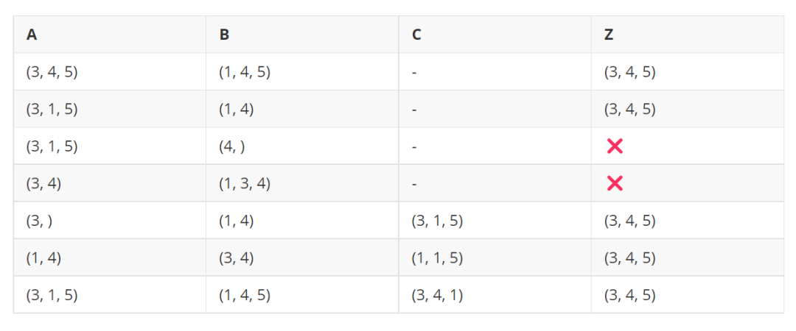

# 向量化编程与广播（2）：广播的规则
## 著作信息
- 原作者：陈久宁
- 最早于 2022-05-31 22:39 发布于 JuliaCN 公众号

## 前言
在上一篇[向量化编程与广播（1）：引言](20220515.md)中我们介绍了 `meshgrid` 这个函数的由来，以及表明广播的存在使得它在大多数时候已经成为一个不必要的函数了。在这一篇中我们将更具体地介绍广播的基本规则，从而在实际编程中可以能够更自如地使用这一概念。
* `A .* B` 在什么时候可以成功运算？
* 成功运算之后的结果该如何理解？
* 如何在实际计算中更好地利用广播？

## 作为广义的逐点运算
在上一篇中我们介绍了二维曲面的在全部格点坐标上的值可以以广播的形式获得一个简洁且高效的实现：
```jl
X = 1:4
Y = 5:7

f(x, y) = x*exp(-x^2-y^2)

Z = f.(X, Y') # 尺寸为 4×3
```

并且在这背后有 `Z[i, j] == f(X[i], Y[j])` 的等价关系存在。

虽说从编程的角度来理解广播不过是 for 循环的一种等价实现，但从数值计算的角度来理解的话，我们更多的则是使用「逐点运算」这个概念来表示。

例如：对于 `A .* B` 我们会说 “A 与 B 进行逐点运算”。然而在直觉上，我们会要求逐点运算中除标量以外，所涉及的数组均具有相同的尺寸。在这个意义上，`f.(X, Y')` 显然已经超过了我们最初的直觉认识。

我们以两个数组的情况为例介绍广播的规则：

1. 当数组 A 的维度 N 与数组 B 的维度 M 不一致时 （不妨假设 N < M），沿着高维方向扩充 A 的维度使其维度一致。当维度一致时，继续下面第二条规则。
2. 当数组 A 的尺寸 $(n_1, n_2, \cdots , n_M)$ 与数组 B 的尺寸 $(m_1, m_2, \cdots , m_M)$ 不一致，且不一致的维度上存在一个长度为 1 的情况时，在该维度上进行一次复制来使其长度一致。
3. 否则的话，不符合广播运算的规则。

回到上面的 `f.(X, Y')` 的例子来尝试用该规则理解一下：X 是一个一维向量 `size(X) == (4, )`，而 Y' (向量 Y 的转置) 是一个二维矩阵 `size(Y) == (1, 3)`. 这里两个数组的维度并不相同，那么好的，根据**规则 1**，我们有
```jl
# 将 X 扩充到二维矩阵
X̃ = reshape(X, size(X)..., 1) # 尺寸：(4, 1)
```

此时虽然维度一致了，但尺寸并不一致。由于 X̃ 与 Y' 各存在一个长度为 1 的维度，所以可以继续应用**规则 2**：
```jl
# 将 X̃ 的第二维复制 3 份
X̂ = repeat(X̃, 1, 3) # 尺寸：(4, 3)
# 将 Y' 的第一维复制 4 份
Ŷ = repeat(Y', 4, 1) # 尺寸：(4, 3)
```
于是，广播根据上述两条规则被转换为了我们所熟悉的逐点运算的概念。

当然在实际的广播计算过程中，Julia 并不会产生真正的数据复制，所以前面的 `reshape` 与 `repeat` 实际上都不会发生。又或者说，这个复制与维度扩充的操作只是在一个虚拟的意义上发生。如果依然对此感到担心的话，不妨做一个性能测试看看：
```julia-repl
julia> f.(X, Y') == f.(X̂, Ŷ) # 等价计算
true

julia> @btime f.($X, $(Y')); # 广播
  58.784 ns (1 allocation: 160 bytes)

julia> @btime f.($X̂, $Ŷ); # 手动复制后进行逐点运算
  62.562 ns (1 allocation: 160 bytes)
```

可以看到，广播与逐点运算均只会分配一次内存，用于存储输出结果 —— 这表明广播的内部实际上并没有发生数据复制。
!!! note
	Python 的 NumPy 等数值计算框架也支持广播运算，但在规则上与 Julia 不同的一点在于 Python 的维度扩充是沿着低维方向进行的。因此 `rand(3, 4) .* rand(3)` 在 Julia 下是一个合法的广播计算，而在 Python 下不合法 —— 在 Python 下 `np.random.rand(3, 4) * np.random.rand(4)` 是一个合法的广播计算。

## 小练习
为了确保了解广播的规则，这里提供几个简单的小例子作为一个思维训练，它们在实际编程中并不一定会出现，但却是一个很好的练习。
!!! note
	`Z = f.(A, B)` （或者 `f.(A, B, C)` ）为输出数组，A, B, C 为输入数组，函数 f 是一个标量函数。我们只需要分析它们的尺寸就可以判断是否能够进行广播，以及广播的结果是什么。



## 数组的转置
再来一个小练习：如何将二维矩阵 X 的第 i 列乘 i 倍？
```julia-repl
julia> X = reshape(1:12, 3, 4); # size: (3, 4)

julia> r = 1:size(X, 2); # size: (4, )

julia> X .* r'
3×4 Matrix{Int64}:
 1   8  21  40
 2  10  24  44
 3  12  27  48
```
在日常编程中，像上面这样通过转置 `'` 来对齐数组的不同维度从而利用广播机制是一个很常见的计算手段。因此这里也简单介绍一下 `permutedims` 函数及其使用。

!!! note
	`'` 实际上指的是共轭转置 adjoint，因此对于复数矩阵来说，并不是单纯的交换维度。只是对于二维实矩阵来说，`A' == adjoint(A) == permutedims(A, (2, 1))` 是一个简便的写法。

`permutedims(A, perm)` 里面的 perm 来源于数学中的置换概念。我们称

$$f=\begin{pmatrix}a_1 & a_2 & a_3 & \cdots & a_m\\b_1 & b_2 & b_3 & \cdots & b_m\end{pmatrix}$$

定义了一个「置换（permutation）」，即 $f(a_i) == b_i$。对于 m 维数组 A 进行维度的交换 `B = permutedims(A, perm)` 这件事情来说，置换的是维度的下标:

$$perm=\begin{pmatrix}p_1 & p_2 & p_3 & \cdots & p_m\\1 & 2 & 3 & \cdots & m\end{pmatrix}$$

即输入 A 的第 $p_i$ 维置换到输出 B 的第 i 维。因为第二排的值始终是不变的，所以只需要第一排的值就可以定义一个有效的 perm 传递给 permutedims
```jl
X = reshape(1:24, 2, 3, 4)

# 将 X 的第一维调整到最后一维，其他维顺延
Y = permutedims(X, (3, 1, 2)) # size: (4, 2, 3)


# 将 Y 的维度置换回原来 X 的维度
Z = permutedims(Y, (2, 3, 1)) # size: (2, 3, 4)
X == Z # true

# 也可以使用 invperm
Z == permutedims(Y, invperm((3, 1, 2))) # true
```

!!! note
	对于初入数值计算的人来说，很容易与 permutedims 混淆的一个函数是 reshape. 关于这一点，只需要记住 reshape 不会改变数值的内存顺序。换句话说，无论如何调整尺寸，当它们被拉成一列的时候值是不变的，即：`vec(X) == vec(reshape(X, dims))`。相比而言，permutedims 则会改变数值的内存顺序。

## 其他
### 不是所有值都可以广播
当我们发现 `f.(X)` 可以触发广播这一用法的时候，很快就会试图在各个场景下去使用，但在使用的时候我们会发现并不是所有值都可以被广播拆解。比如说字符串虽然可以取下标，但 `"hello" .== 'l'` 并不会像你所想的那样返回 `[false, false, true, true, false]` 而是简单的返回 false，再比如说笛卡尔下标的广播计算 `CartesianIndex(2, 3) .+ 1` 会报错。这背后的原因都是因为它们被 Julia 设计成了一个整体性的标量值 —— 而广播作为逐元素运算破坏了这种整体性。在这种情况下，一般会将它们转换为支持广播的集合，例如 `collect("hello") .== 'l'` 和 `Tuple(CartesianIndex(2, 3)) .+ 1`

### 套一层 Ref 或者 Tuple 的单元素集合就可以关闭广播
有时候我们可能会想要希望 `[[1, 1], [2, 2]] .+ [1, 2]`  得到 `[[2, 3], [3, 4]]` 这样的结果，但 `[1, 2]` 作为向量会自动参与到广播的计算中然后被分解为 `[1, 1] + 1` 和 `[2, 2] + 2` 这两个计算 （然后你就会看到报错信息）。解决的方案也很简单，只需要在 `[1, 2]` 外层套一个随便什么样的单元素集合就可以了，比如说：`[[1, 1], [2, 2]] .+ ([1, 2], )` 或者 `[[1, 1], [2, 2]] .+ Ref([1, 2])`。在这里虽然 Ref  本来是在 C 接口的指针和引用 (reference) 意义上定义的，但因为太好用以至于很多时候被用在广播中来标记一个整体值。当然，在外面套一层向量 `[[1, 2]]` 也是可以的，但因为向量的创建本身有一定性能开销，因此在实际中并不会使用。

## 小结
在这里我们以直观的方式介绍了广播的具体规则来对应我们所熟知的逐点运算的概念，希望能够让大家对这一概念掌握地更好。

关于广播这一话题计划再用三篇来介绍。首先会在下一篇介绍 fused dots 混合广播这一性能实践，然后介绍向量化编程的概念。在比较远的未来打算再回过头来介绍广播的接口和实现。这样计划的原因是绝大部分 Julia 程序员只需要掌握如何使用广播就足够了，大部分人（包括我自己在内）的日常编程并不需要涉及到自定义广播这一概念。
