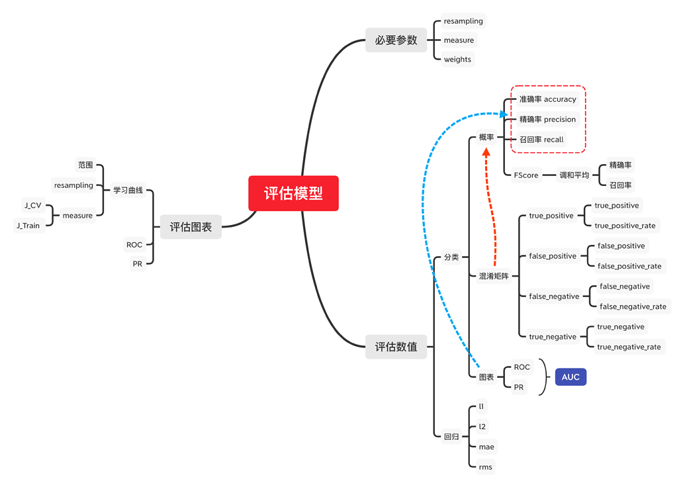
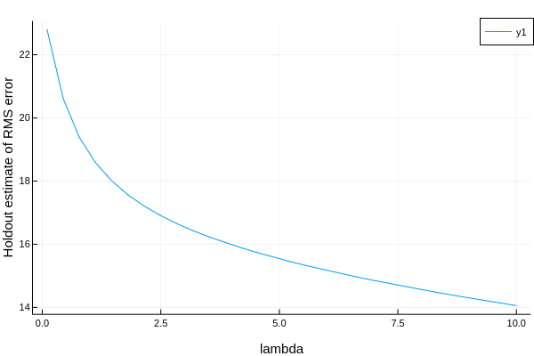
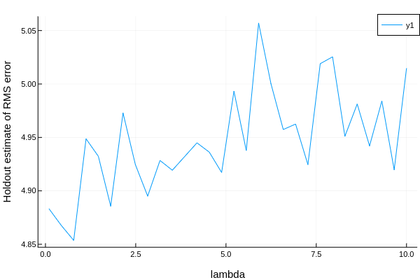
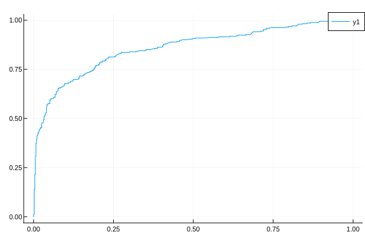

# 评估模型


## 一个例子
数据准备
```julia-repl
X = (a = rand(12), b = rand(12), c = rand(12))
y = X.a .+ 2 .* X.b + 0.05 .* rand(12)
```
模型训练
```julia-repl
model = @load RidgeRegressor pkg=MultivariateStats
```

「评估」单个measure

```julia-repl
rng = StableRNG(1234)
cv = CV(nfolds = 3, shuffle = true) # 重采样策略
evaluate(model, X, y, resampling = cv, measure = l2)

# 也可以这样, 下面也是
mach = machine(model, X, y)
evaluate!(mach, resampling = cv, measure = l2)
```

| _.measure | _.measurement | _.per_fold           |
| :-: | :-: | :-: |
| l2        | 0.164         | [0.105, 0.23, 0.158] |

_.per_observation = [[[0.288, 0.128, ..., 0.186], [0.136, 0.534, ..., 0.348], [0.435, 0.0345, ..., 0.298]], missing, missing]

「评估」多个measure
```julia-repl
evaluate(model, X, y, resampling = cv, measure = [l1, rms, rmslp1])
```
| _.measure | _.measurement | _.per_fold            |
| :-: | :-: | :-: |
| l1        | 0.35          | [0.505, 0.319, 0.226] |
| rms       | 0.424         | [0.51, 0.454, 0.273]  |
| rmslp1    | 0.197         | [0.193, 0.256, 0.116] |

_.per_observation = [[[0.61, 0.514, ..., 0.414], [0.00912, 0.486, ..., 0.0136], [0.139, 0.144, ..., 0.491]], missing, missing]

来看看文档是怎么解释这些参数的
* measure: the vector of specified measures
* measurements: the corresponding measurements, aggregated across the test folds using the aggregation method defined for each measure (do `aggregation(measure)` to inspect)
* per_fold: a vector of vectors of individual test fold evaluations (one vector per measure)
* per_observation: a vector of vectors of individual observation evaluations of those measures for which `reports_each_observation(measure)` is `true`, which is otherwise reported `missing`.

!!! note
    在这里我们统一用`evaluate!(machine)`的规定

## 评估模型的必要参数
### resampling 
内置重采样策略有三个， Holdout, CV 与 StratifiedCV

#### Holdout
其实就跟`sklearn`里的`train_test_split`差不多，将训练集和测试集按一定比例划分
```julia-repl
holdout = Holdout(; fraction_train=0.7,
                   	shuffle=nothing,
					rng=nothing)
```
#### CV
交叉验证重采样策略
```julia-repl
cv = CV(; nfolds=6,  shuffle=nothing, rng=nothing)
```
#### StratifiedCV
分层交叉验证重采样策略,仅适用于分类问题（OrderedFactor或Multiclass目标）
```julia-repl
stratified_cv = StratifiedCV(; nfolds=6,
                               shuffle=false,
                               rng=Random.GLOBAL_RNG)
```
### measure
#### 分类指标

1. 混淆矩阵
|           | Ground   | Truth         |
| :-: | :-: | :-: |
| Predicted | Positive | Negative |
| True      | TP       | FN       |
| False     | FP       | TN       |

	
2. 由混淆矩阵推导出的概率
   - 准确率 
   - 精确率
   - 召回率
   
   「补充」FScore为精确率与召回率的调和平均

   
我太懒了，别人比我总结的好，看[这篇文章](https://zhuanlan.zhihu.com/p/46714763)吧

#### 回归指标
1. l1 `∑|(Yᵢ - h(xᵢ)|`
2. l2 `∑(Yᵢ - h(xᵢ))²`
3. mae 平均绝对误差 `l1(Ŷ,h(xᵢ)) / n`
4. mse 平均平方误差 `l2(Ŷ,h(xᵢ)) / n`
5. rmse 均方根误差 `√(∑(ŷ - y)²`

函数我都写在w思维导图里了，详细文档[看这里](https://alan-turing-institute.github.io/MLJ.jl/stable/performance_measures/)

#### 扩展包 LossFunction
TODO LossFunctions (外部包)查询
包介绍
> The LossFunctions.jl package includes "distance loss" functions for Continuous targets, and "marginal loss" functions for Binary targets. While the LossFunctions,jl interface differs from the present one (for, example Binary observations must be +1 or -1), one can safely pass the loss functions defined there to any MLJ algorithm, which re-interprets it under the hood. Note that the "distance losses" in the package apply to deterministic predictions, while the "marginal losses" apply to probabilistic predictions.

github地址:
https://github.com/JuliaML/LossFunctions.jl

`LossFunctions`提供了更多的指标，拿文档里的代码举个例子 
```julia-repl
using LossFunctions

X = (x1=rand(5), x2=rand(5));
y = categorical(["y", "y", "y", "n", "y"]);
w = [1, 2, 1, 2, 3];

mach = machine(ConstantClassifier(), X, y);
holdout = Holdout(fraction_train=0.6);
evaluate!(mach,
          measure=[ZeroOneLoss(), L1HingeLoss(), L2HingeLoss(), SigmoidLoss()],
          resampling=holdout,
          operation=predict,
          weights=w)
```
| _.measure   | _.measurements | _.per_fold |
| :-: | :-: | :-: |
| ZeroOneLoss | 0.4            | [0.4]      |
| L1HingeLoss | 0.8            | [0.8]      |
| L2HingeLoss | 1.6            | [1.6]      |
| SigmoidLoss | 0.848          | [0.848]    |
_.per_observation = [[[0.8, 0.0]], [[1.6, 0.0]], [[3.2, 0.0]], [[1.409275324764612, 0.2860870128530822]]]


### weights
权重，无所谓了，必要的时候才设

## 评估模型的图表
### 学习曲线
```julia-repl
curve = learning_curve(mach; resolution=30,
    resampling=Holdout(),
    repeats=1,
    measure=default_measure(machine.model),
    rows=nothing,
    weights=nothing,
    operation=predict,
    range=nothing,
    acceleration=default_resource(),
    acceleration_grid=CPU1(),
    rngs=nothing,
    rng_name=nothing
)
```
其实只是名字一样，给定一个范围`range`(only one)，得到一个曲线`curve`，这个曲线表示这个范围内的所有性能（指标）
上面那个`resolution=30`说明`learning_curve`使用`Grid`作获取参数的策略

**example** 观察一个模型的性能
```julia-repl
X, y = @load_boston

@load RidgeRegressor pkg=MultivariateStats
model = RidgeRegressor()
mach = machine(model, X, y)

r_lambda = range(model, :lambda, lower = 0.01, upper = 10.0, scale = :linear)
```

**默认重采样策略Holdout**
```julia-repl
curves = learning_curve(mach,
    range = r_lambda,
    measure = rms)
plot(curves.parameter_values,
    curves.measurements,
    xlab = curves.parameter_name,
    ylab = "Holdout estimate of RMS error")
```



**指定重采样策略**
```julia-repl
using Plots
rng = StableRNG(1234)

curves = learning_curve(mach,
                        resampling = CV(nfolds = 6, rng = rng),
                        range = r_lambda,
                        measure = rms)
plot(curves.parameter_values,
     curves.measurements,
     xlab = curves.parameter_name,
     ylab = "Holdout estimate of RMS error")

```



### 3.2 ROC
```julia-repl
fprs, tprs, ts = roc_curve(ŷ, y) = roc(ŷ, y)
```
如果我们的测试数据集类别分布大致均衡的时候我们可以用ROC曲线
给定基本事实y，两类概率预测ŷ，返回ROC曲线。ts返回阈值范围内的真阳性率，假阳性率
其中
1. fprs: 假阳性率
2. tprs: 真阳性率
3. ts: thresholds 阈值

**example** 
这里我不给出代码了，因为`roc`曲线评估的是分类问题，加载数据集，处理那些操作太多了，我就先放图片好了，具体的流程在**Titanic幸存预测里**

### 3.3 PR
当数据集类别分布非常不均衡的时候采用PR曲线
但是很遗憾，文档里找不到这个东西

### 3.3 真正的学习曲线
虽然我找不到这个实现，但是我自己先做了一个
```julia-repl
function plot_learning_curve(model, X, y)
    mach = machine(model, X, y)
    training_size_iter = 5:10:length(y)
    errors = ones(length(training_size_iter), 2)
    rng = StableRNG(1234)

    row = 1                     # for iterate
    for training_size = training_size_iter
        train, cv = partition(1:training_size, 0.7, rng = rng)
        fit_only!(mach, rows = train)
        
        m_train = length(train)
        Jtrain = (1 / (2 * m_train)) * reduce(+, map(x -> x^2, predict(mach, rows = train) - y[train]))

        m_cv = length(cv)
        Jcv = (1 / (2 * m_cv)) * reduce(+, map(x -> x^2, predict(mach, rows = cv) - y[cv]))

        errors[row, :] = [Jtrain, Jcv]

        row += 1
    end

    plot(errors,
         label = ["Jtrain" "Jcv"],
         color = [:red :blue],
         xlab = "training size",
         ylab = "error")


end
```

试试看
```julia-repl
@load RidgeRegressor pkg=MultivariateStats
model = RidgeRegressor()
X, y = @load_boston

# Tuning
rng = StableRNG(1234)
r_lambda = range(model, :lambda, lower = 0.1, upper = 10.0, scale = :linear)
tuning = Grid(resolution = 100, rng = rng)
resampling = CV(nfolds = 6, rng = rng)
self_tuning_model = TunedModel(model = model,
                               range = r_lambda,
                               tuning = tuning,
                               resampling = resampling,
                               measure = l1)
self_tuning_mach = machine(self_tuning_model, X, y)
fit!(self_tuning_mach, force = true)

best_model = fitted_params(self_tuning_mach).best_model

plot_learning_curve(best_model, X, y)
```

看着有点不对啊:yum:


