# 机器学习算法介绍
这里简要介绍下各算法和他们之间的关系，详细理解请百度一下  

## 基本算法
最小二乘法是众多机器学习算法中极为重要的一种基础算法\
单纯的最小二乘法对于包含噪声的学习过程经常有过拟合的弱点，这往往是由于学习模型对于训练样本而言过于复杂

## l2 约束
由此，引入带有约束条件的最小二乘法 -&#x2014; Ridge 回归\
带有约束条件的最小二乘法和交叉验证法的组合，在实际应用中是非常有效的回归方法\
然而，当参数特别多的时候，求解各参数以及学习得到的函数的输出值的过程，都需要耗费大量的时间\

## l1 约束
由此，引入可以吧大部分参数都置为0的稀疏学习算法  
因为大部分参数都变成了0，所以就可以快速地求解各参数以及学习得到的函数的输出值  

## l1 + l2 约束
虽然 l1 约束的最小二乘学习法是非常有用的学习方法，但是在实际应用中，经常会遇到些许限制
-   在 Lasso 回归求解路径中，对于 N×P 的设计矩阵来说，最多只能选出 min(N,p) 个变量  
    当 p>N 的时候，最多只能选出N个预测变量．因此，对于 p∼N 的情况，Lasso方法不能够很好的选出真实的模型．
-   如果预测变量具有群组效应，则用Lasso回 归时，只能选出其中的一个预测变量
-   对于通常的 N>P 的情形，如果预测变量中 存在很强的共线性，Lasso的预测表现受控于岭回归

基于以上几点Lasso回归的局限性，Zou和 Hastie在2005年提出了弹性网回归方法，回归系数表达式为

$$\hat \beta^{ridge} =\mathop{\arg\min}_{\beta}  \{\sum \limits _{i=1}^{N}(y_i-\beta_0-\sum\limits_{j=1}^px_{ij}\beta_j)^2+\lambda\sum \limits_{j=1}^{p}|\beta_{j}|+\lambda\sum \limits_{j=1}^{p}\beta_{j}^2\}$$

# MLJLinearModels 使用
## Ridge
$$J = \frac{1}{n}\sum_{i = 1}^n (f( x_i) - y_i)^2 + \lambda \|w\|_2^2\tag{1}$$

**RidgeRegressor**  
```jl
RidgeRegression()
RidgeRegression(λ; lambda, fit_intercept, penalize_intercept, scale_penalty_with_samples)
```


## Lasso

$$J = \frac{1}{n}\sum_{i = 1}^n (f( x_i) - y_i)^2 + \lambda \|w\|_1\tag{2}$$  

**LassoRegressor**  
```jl
LassoRegression()
LassoRegression(λ; lambda, fit_intercept, penalize_intercept, scale_penalty_with_samples)
```

## Elastic-Net
$$\smash{\min_{w}}\sum_{i=1}^m(y_i-\sum_{j=1}^dx_{ij}w_j)^2 + \lambda\sum_{j=1}^d|w_j|+\lambda \sum_{j=1}^dw_j^2 \tag{3}$$

**ElasticNetRegression**  
```jl
ElasticNetRegression()
ElasticNetRegression(λ)
ElasticNetRegression(λ, γ; lambda, gamma, fit_intercept, penalize_intercept, scale_penalty_with_samples)
```

## 说明
其实可以不用管  
- `fit_intercept`
- `penalize_intercept`

我也不知道这两个是干什么的，就先别管他们了  
总之，只用设置 `lambda` 就行了  

# 实例 波士顿房价预测
## 数据准备

竞赛数据来自 <https://www.kaggle.com/competitions/house-prices-advanced-regression-techniques/overview>  
```jl
using MLJ, CSV, StableRNGs, MLJLinearModels, Plots
import DataFrames: DataFrame, select, describe
using Statistics    

dataTrain = CSV.read("data/train.csv", DataFrame)
dataTest = CSV.read("data/test.csv", DataFrame)
```

## 观察各项主要特征与房价售价的关系

### 分析 SalePrice
!!! note
    存疑
```jl
julia> describe(dataTrain[!, :SalePrice])
Summary Stats:
Length:         1460
Missing Count:  0
Mean:           180921.195890
Minimum:        34900.000000
1st Quartile:   129975.000000
Median:         163000.000000
3rd Quartile:   214000.000000
Maximum:        755000.000000
Type:           Int64
```

通过上面的结果可以知道 **SalePrice** 没有无效或者其他非数值的数据，下面通过图示化来进一步展示 **SalePrice**  

  

这里需要一个 `distplot` 函数来绘制图像  

1.  得到数组的 **distribution**
2.  画出这个分布

然而我还不会这个东西，放一放  

### 分析特征数据
入选特征
| 变量名 | 数据类型 | 说明 |
| --- | --- | --- |
| LotArea | Continuous | 地皮面积 |
| GrLiveArea | Continuous | 生活面积 |
| TotalBsmtSF | Continuous | 地下室总面积 |
| MiscVal | Continuous | 其他资产 |
| GarageCars | Count | 容纳车辆 |
| GarageArea | Continuous | 车库面积 |
| YearBuilt | Multiclass | 建造年份 |
| CentralAir | Multiclass | 中央空调 |
| OverallQual | Multiclass | 总体评价 |
| Neighborhood | Multiclass | 地段 |

### 验证主要特征是否满足要求
1.  类别型特征
    1.  CentralAir 中央空调
        ```jl
        using StatsPlots
        let column = :CentralAir
            columnY = dataTrain[!, :SalePrice]
            columnX = dataTrain[!, column]
            boxplot(columnX, columnY) |> display
        end
        ```
        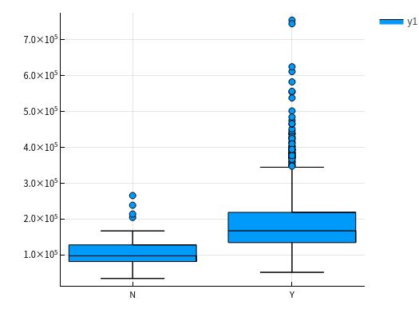  
        可以很明显的看到有中央空调的房价明显更高。  
    2.  OverallQual 总体评价
        ```jl
        let column = :OverallQual
            columnY = dataTrain[!, :SalePrice]
            columnX = dataTrain[!, column]
            boxplot(columnX, columnY) |> display
        end
        ```
        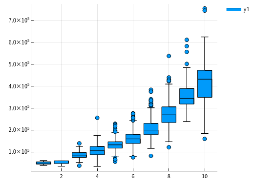  
    3.  YearBuilt 建造年份
        ```jl
        let column = :YearBuilt
            columnY = dataTrain[!, :SalePrice]
            columnX = dataTrain[!, column]
            boxplot(columnX, columnY, size=(2600, 1200)) |> display
        end
        ```
        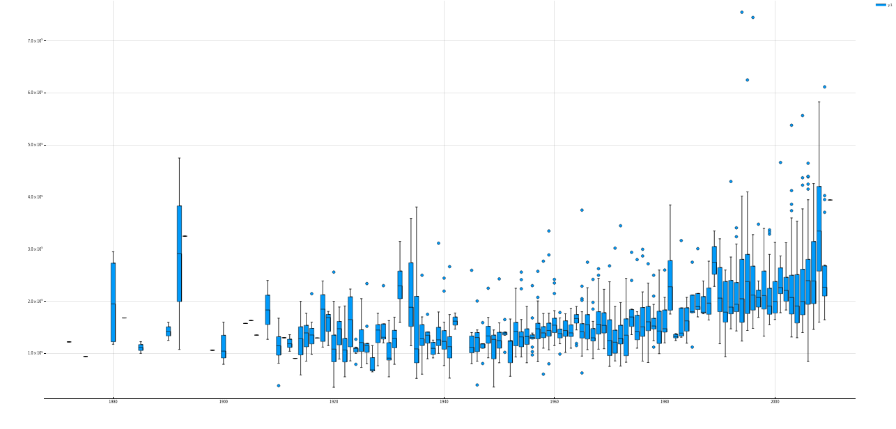  
        ```jl
        let column = :YearBuilt
            columnY = dataTrain[!, :SalePrice]
            columnX = dataTrain[!, column]
            boxplot(columnX, columnY, size=(2600, 1200)) |> display
            scatter(columnX, columnY, ylim=(0, 800000), size=(1500, 1000)) |> display
        end
        ```
        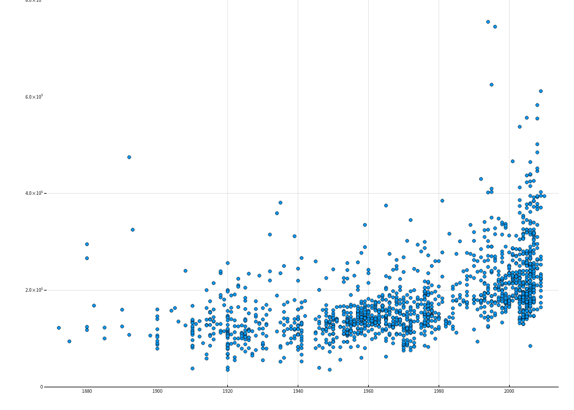  
        
        最开始我是用了箱线图绘制了房价与建造年份的关系，但是并不十分明显，所以又用点图来显示，可以很明显的看到有线性增长的趋势
    4.  Neighborhood 地段
        ```jl
        let column = :Neighborhood
            columnY = dataTrain[!, :SalePrice]
            columnX = dataTrain[!, column]
            boxplot(columnX, columnY, size = (1300, 600)) |> display
        end
        ```
        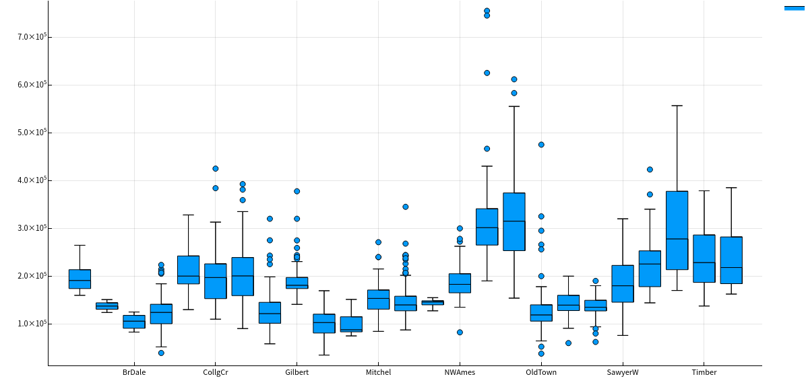  
        
        这个该怎么分析呢。。。。。。待定
2.  数值型特征
    1.  LotArea 地表面积
        ```jl
        let column = :LotArea
            columnY = dataTrain[!, :SalePrice]
            columnX = dataTrain[!, column]
            scatter(columnX, columnY) |> display
        end
        ```
        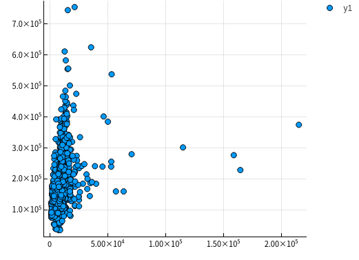  
        好像该特征并没有什么差别，所以不予考虑  
    2.  GrLivArea 生活面积
        ```jl
        let column = :GrLivArea
            columnY = dataTrain[!, :SalePrice]
            columnX = dataTrain[!, column]
            scatter(columnX, columnY) |> display
        end
        ```
        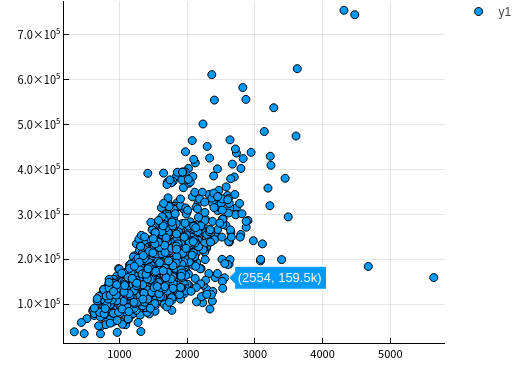  
    3.  TotalBsmtSF 地下室总面积
        ```jl
        let column = :TotalBsmtSF
            columnY = dataTrain[!, :SalePrice]
            columnX = dataTrain[!, column]
            scatter(columnX, columnY) |> display
        end
        ```
        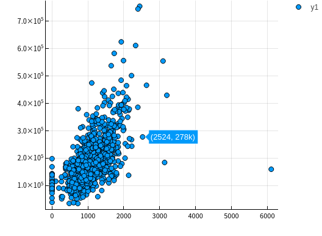
    4.  MiscVal
        ```jl
        let column = :MiscVal
            columnY = dataTrain[!, :SalePrice]
            columnX = dataTrain[!, column]
            scatter(columnX, columnY) |> display
        end
        ```
        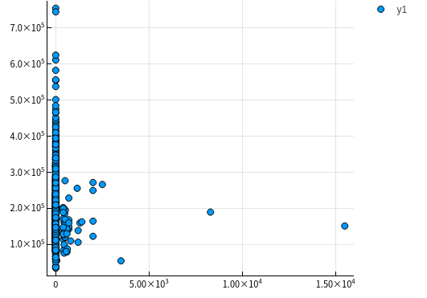  
    5.  GarageArea/GarageCars 车库
        ```jl
        let columns = [:GarageArea, :GarageCars]
            columnY = dataTrain[!, :SalePrice]
            columnXs = map(column -> dataTrain[!, column], columns)

            for columnX in columnXs
            scatter(columnX, columnY) |> display
            end
        end
        ```
        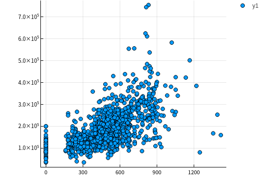  
        
        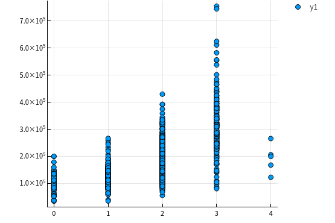  
        由上面点图可以看出房价与车库面积和容纳车辆数呈现线性关系，所以入选主要特征

## 更加科学的分析数据

上面的分析可以说非常主观，所以说多多少少还是会不放心，会担心自己选择的特征会不会多了或者少了，  
又或者选了一些没有太大作用的特征，所以接下来需要进行更加科学的分析  
为了做到更加科学，我们需要作如下工作：  

-   得到各个特征之间的关系矩阵 &#x2013; correlation matrix
-   SalePrice 的关系矩阵
-   绘制出最相关的特征之间的关系图


### 关系矩阵

教程中有局限性， **关系矩阵只涉及到数值型数据** ，这里我们也这样做，因为他的特征数有80多个，我懒得弄  

    let _schema = schema(dataTrain)
        _names = _schema.names
        _scitypes = _schema.scitypes
        indexs = collect(map(x -> x == Count || x == Continuous, _scitypes))
        columns = _names[indexs] |> collect
        _data = select(dataTrain, columns)
        _corr = cor(Matrix(_data))
        labels = string.(columns)
        heatmap(labels, labels, _corr, xrotation = -90, size = figureSize, xticks = :all, yticks = :all) |> display
    end

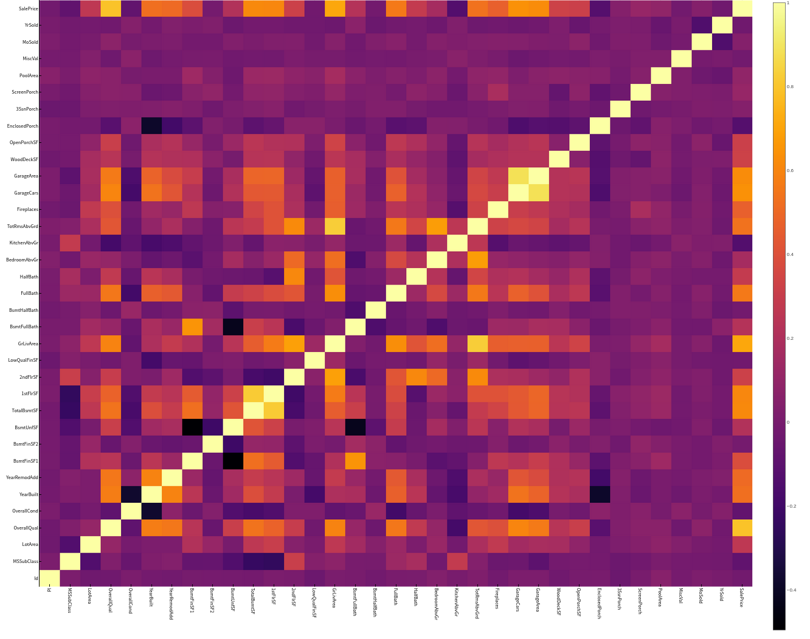  
像素块越亮表示两者之间相关性越强，我们可以很清楚地看到与“SalePrice”相关性很强的有  

-   `OverallQual` 总评价
-   `YearBuilt` 建造年份
-   `ToatlBsmtSF` 地下室面积
-   `1stFlrSF` 一楼面积
-   `GrLiveArea` 生活区面积
-   `FullBath` 浴室？what。。。到底什么意思，知道的麻烦说一下
-   `TotRmsAbvGrd` 总房间数（不包括浴室）
-   `GarageCars` 车库可容纳车辆数
-   `GarageArea` 车库面积


### [存疑]房价关系矩阵

这里显示相关性最大的10个特征  

    k  = 10 # 关系矩阵中将显示10个特征
    cols = corrmat.nlargest(k, 'SalePrice')['SalePrice'].index
    cm = np.corrcoef(data_train[cols].values.T)
    sns.set(font_scale=1.25)
    hm = sns.heatmap(cm, cbar=True, annot=True, \
    		 square=True, fmt='.2f', annot_kws={'size': 10}, yticklabels=cols.values, xticklabels=cols.values)
    plt.show()

我不知道这个代码是怎么运行的，他是怎么画出这个热力图的  

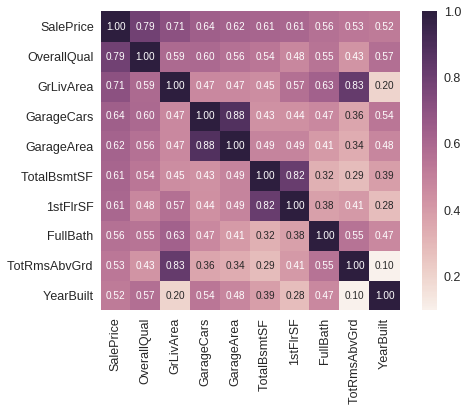  

**重点是 `corrmat.nlargestk` 是怎么得出 10x10 的矩阵**  

我只做到这里  

    let _schema = schema(dataTrain)
        _names = _schema.names
        _scitypes = _schema.scitypes
        indexs = collect(map(x -> x == Count || x == Continuous, _scitypes))
        columns = _names[indexs] |> collect
        labels = string.(columns)
        _data = select(dataTrain, columns)
        _corr = cor(Matrix(_data))
    
        _dataframe = DataFrame(_corr, columns)
        nlarget = _dataframe[partialsortperm(_dataframe[!, :SalePrice], 1:10, rev=true), :]
    
        heatmap(Matrix(nlarget), xrotation = -90, size = figureSize, xticks = :all, yticks = :all, aspect_ratio = :equal)
    
        nrow, ncol = size(_corr)
        fontsize = 15
    
        fn(tuple) = (tuple[1], tuple[2], text(round(_corr[tuple[1], tuple[2]], digits = 2), fontsize, :white, :center))
        ann = map(fn, Iterators.product(1:nrow, 1:ncol) |> collect |> vec)
    
        annotate!(ann, linecolor = :white) |> display
    end

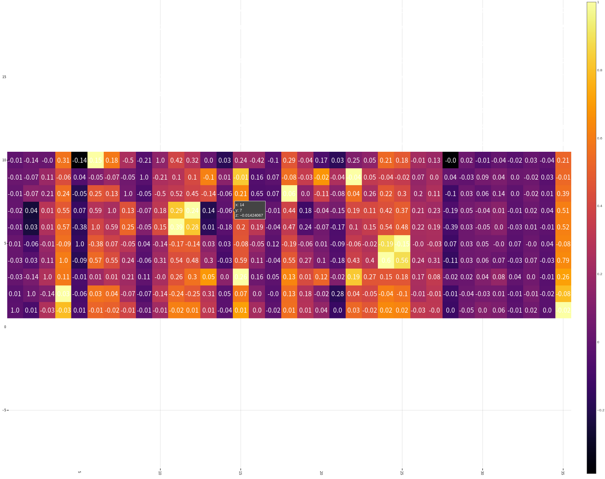  

疑点如下  

1.  如何获取 `Dataframe` 最大的 10x10 切片
2.  `Dataframe` 的字段名也要根据数据排序进行修改吧？


### [存疑]绘制关系点图

目前找到一个 `PairPlots` 包，我还要研究一下  


## 开始模拟数据


### 处理数据

1.  首先我们选取特征  
    
        columns = [:OverallQual, :GrLivArea, :GarageCars, :TotalBsmtSF, :FullBath, :TotRmsAbvGrd, :YearBuilt]

2.  定义训练集的处理模型  
    
        trainTransformModel = Pipeline(
            FeatureSelector(features = columns),
            dataframe -> coerce(dataframe, Count => Continuous))

3.  定义测试集的处理模型  
    
        processFeature!(dataframe::DataFrame) = begin
            dataframe[!, :GarageCars] = replace(dataframe[!, :GarageCars], "NA" => missing)
            dataframe[!, :GarageCars] = map(x -> ismissing(x) ? x : parse(Float64, x), dataframe[!, :GarageCars])
            dataframe[!, :TotalBsmtSF] = replace(dataframe[!, :TotalBsmtSF], "NA" => missing)
            dataframe[!, :TotalBsmtSF] = map(x -> ismissing(x) ? x : parse(Float64, x), dataframe[!, :TotalBsmtSF])
        
            coerce!(dataframe, Count => Continuous)
            return dataframe
        end
        
        testTransformModel = Pipeline(
            FeatureSelector(features = columns),
            processFeature!,
            FillImputer(features = columns),
            # Standardizer(features = columns)
        )

4.  处理原始数据，产出数据集  
    
        trainTransformMach = machine(trainTransformModel, dataTrain)
        testTransformMach = machine(testTransformModel, dataTest)
        fit!(trainTransformMach)
        fit!(testTransformMach)
        
        transformedDataTrain = transform(trainTransformMach, dataTrain)
        transformedDataTest = transform(testTransformMach, dataTest)

5.  拿出训练用数据  
    
        X = transformedDataTrain
        y = coerce(dataTrain[!, :SalePrice], Continuous)
        train, test = partition(eachindex(y), 0.8, rng=rng)


### 模型训练

这里我们使用 **Ridge** 模型来检验  

    rng = StableRNG(1234)
    cv = CV(nfolds = 6, rng = rng)
    tuning = Grid(resolution=10, rng = rng)
    
    # MODULE try Ridge
    ridge = RidgeRegressor()
    rangeLambda = range(ridge, :lambda, lower = 0.1, upper = 10.0, scale=:log)
    
    
    tunedModel = TunedModel(model = ridge,
    			range = [rangeLambda],
    			measure = rms,
    			resampling = cv,
    			tuning = tuning)
    tunedMach = machine(tunedModel, X, y)
    fit!(tunedMach, rows = train)
    
    evaluate!(tunedMach, resampling = cv, measure = [rms, l1], rows = test)

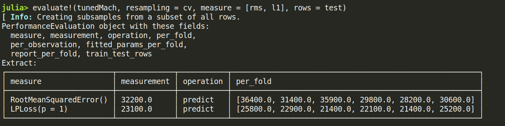  


### 补充: lightGBM 模型训练

    LGBMRegressor = @load LGBMRegressor
    lgb = LGBMRegressor()
    lgbm = machine(lgb, X, y)
    boostRange = range(lgb, :num_iterations, lower = 2, upper = 500)
    rangeLeaf = range(lgb, :min_data_in_leaf, lower = 1, upper = 50)
    rangeIteration = range(lgb, :num_iterations, lower = 50, upper = 100)
    rangeMinData = range(lgb, :min_data_in_leaf, lower = 2, upper = 10)
    rangeLearningRate = range(lgb, :learning_rate, lower = 0.1, upper = 1)
    
    tunedModel = TunedModel(model = lgb,
    			tuning = Grid(resolution = 5, rng = rng),
    			resampling = cv,
    			ranges = [rangeIteration, rangeMinData, rangeLearningRate],
    			measure = rms)
    
    tunedMachine = machine(tunedModel, X, y)
    fit!(tunedMachine, rows = train)
    evaluate!(tunedMach, resampling = cv, measure = [rms, l1], rows = test)

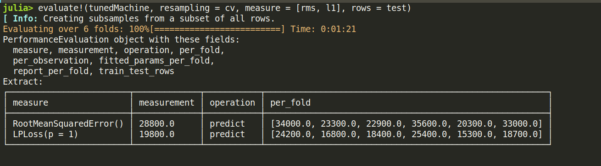  


## 检验测试集数据
这里我们用 **lightGBM** 产出的数据来提交，不得不说，这个模型老牛逼了  
```jl
predictions = predict(tunedMachine, transformedDataTest)
output = DataFrame(Id=dataTest.Id)
output[!, :SalePrice] = predictions
CSV.write("data/submission.csv", output)
```

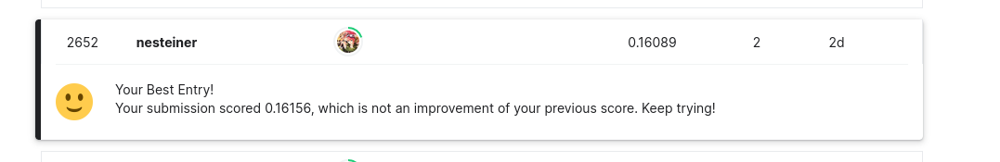  
