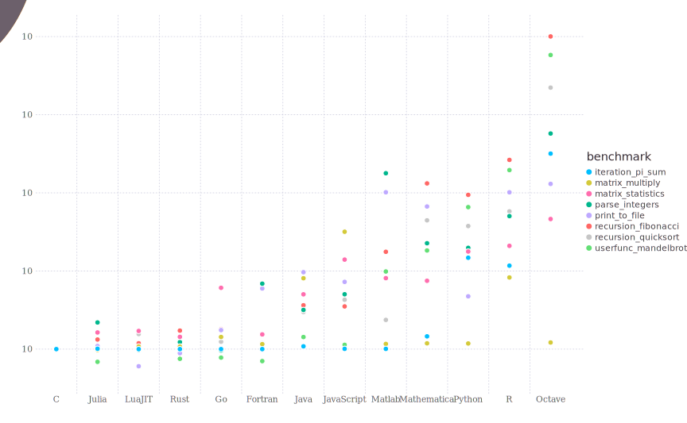

# 文档功能测试
文字，**粗体**，*斜体*，`行内代码`，[内部链接](#标题2)[^1]，[外部链接](http://info.cern.ch/)

## 标题2


1. 1
2. 2

- a
- b

> 引用

!!! note
	note

!!! warn
	warn

!!! compat "HTMLify 1.0"
	compat

```plain
plain
```

```jl
julia> begin foo(nothing,"$(Int)\n") end # comment

help?> 32+`15`#= =# @bar
```

[^1]: footnote
