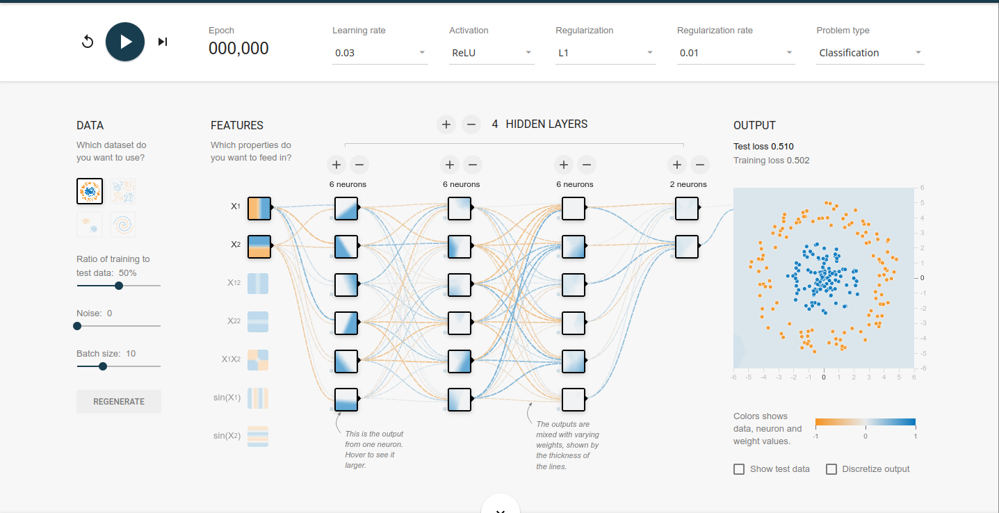

# MLJFlux的使用
[MLJFlux](https://github.com/FluxML/MLJFlux.jl) 就是 **MLJ** 框架对 **Flux** 的封装，由于我学不会 **Flux** ，所以我就退而求其次，学别人装好的工具  
同学们可以参照这个 [PlayGround](https://playground.tensorflow.org/#activation=relu&regularization=L1&batchSize=10&dataset=circle&regDataset=reg-plane&learningRate=0.03&regularizationRate=0.01&noise=0&networkShape=6,6,6,2&seed=0.28619&showTestData=false&discretize=false&percTrainData=50&x=true&y=true&xTimesY=false&xSquared=false&ySquared=false&cosX=false&sinX=false&cosY=false&sinY=false&collectStats=false&problem=classification&initZero=false&hideText=false]]) 来学习 **MLJFlux**  

  

其中  

-   `features` 表示特征
-   `hidden layers` 表示隐藏层
-   `learning rate` 设置学习率
-   `activation` 设置每个神经元的激活函数
-   `regularzation` 设置正则化方法
-   `regularzation rate` 设置正则化惩罚力度

但在 MLJ 和 MLJFlux 中，你是找不到任何有关学习率的参数设置的，因为已经有方法可以不设置学习率了，具体参考[这篇文章](https://blog.csdn.net/u012526436/article/details/90486021)  
在 MLJFlux 中，有以下几种模型  

<table border="2" cellspacing="0" cellpadding="6" rules="groups" frame="hsides">

<colgroup>
<col  class="org-left" />

<col  class="org-left" />

<col  class="org-left" />

<col  class="org-left" />
</colgroup>
<thead>
<tr>
<th scope="col" class="org-left">model type</th>
<th scope="col" class="org-left">prediction type</th>
<th scope="col" class="org-left">scitype(x) &lt;: _</th>
<th scope="col" class="org-left">scitype(y) &lt;: _</th>
</tr>
</thead>

<tbody>
<tr>
<td class="org-left">NeuralNetworkRegressor</td>
<td class="org-left">Deterministic</td>
<td class="org-left">Tale{Continuous} with nin columns</td>
<td class="org-left">AbstractVectir{&lt;:Continuous} nout = 1</td>
</tr>

<tr>
<td class="org-left">MultitargetNeuralNetworkRegressor</td>
<td class="org-left">Deterministic</td>
<td class="org-left">Table{Continuous} with nin columns</td>
<td class="org-left">&lt;: Table(Continuous) with nout columns</td>
</tr>

<tr>
<td class="org-left">NeuralNetworkClassifier</td>
<td class="org-left">Probabilistic</td>
<td class="org-left">&lt;:Table(Continuous) with nin columns</td>
<td class="org-left">AbstractVector{&lt;:Finite} with nout classes</td>
</tr>

<tr>
<td class="org-left">ImageClassifier</td>
<td class="org-left">Probabilistic</td>
<td class="org-left">AbstractVector(&lt;:Image{W,H}) with nin = (W, H)</td>
<td class="org-left">AbstractVector{&lt;:Finite} with nout classes</td>
</tr>
</tbody>
</table>

他们的参数有  

-   `builder` : `Default = MLJFlux.Linear(σ=Flux.relu) (regressors) or MLJFlux.Short(n_hidden=0, dropout=0.5, σ=Flux.σ) (classifiers)`
-   `optimiser` : `The optimiser to use for training. Default = Flux.ADAM()`
-   `loss` : `The loss function used for training. Default = Flux.mse (regressors) and Flux.crossentropy (classifiers)`
-   `n_epochs` : `Number of epochs to train for. Default = 10`
-   `batch_size` : `The batch_size for the data. Default = 1`
-   `lambda` : `The regularization strength. Default = 0. Range = [0, ∞)`
-   `alpha`: `The L2/L1 mix of regularization. Default = 0. Range = [0, 1]`
-   `rng`: `The random number generator (RNG) passed to builders, for weight intitialization, for example. Can be any AbstractRNG or the seed (integer) for a MersenneTwister that is reset on every cold restart of model (machine) training. Default = GLOBAL_RNG.`
-   `acceleration`: `Use CUDALibs() for training on GPU; default is CPU1().`
-   `optimiser_changes_trigger_retraining` : `True if fitting an associated machine should trigger retraining from scratch whenever the optimiser changes. Default = false`

来调几个用的上的参数来说吧，  

-   `builder` 那个 `hidden layer` 的表示
-   `optimiser` 代表优化器，[具体文档](https://fluxml.ai/Flux.jl/stable/training/optimisers/)在这里
-   `loss` 表示损失函数
-   `n_epochs` 表示训练次数
-   `batch_size` 表示每次拿几个数据一起处理
-   `lambda` 表示正则化惩罚力度
-   `alpha` 表示 l2/l1 混合的比例 ？

# 实例

对照上图，以分类问题为例，我们需要新建一个 builder 结构来表示隐藏层，  

-   隐藏层有4层
-   每一层分别有6，6，6，2个神经元
-   每个神经元的激活函数是 ReLu
-   正则化方法是l1
-   正则化惩罚力度是 0.01

由此，创建一个 builder  

    mutable struct NetworkBuilder <: MLJFlux.Builder
      n1::Int # 第一层神经元数
      n2::Int # 第二层神经元数
      n3::Int # 第三层神经元数
      n4::Int # 第四层神经元数
    end

再为其重载 `MLJFlux.build` 方法  

    function MLJFlux.build(model::NetworkBuilder, rng, nin, nout)
      init = Flux.glorot_uniform(rng)
      return Chain(
        Dense(nin, model.n1, relu, init = init),
        Dense(model.n1, model.n2, relu, init = init),
        Dense(model.n2, model.n3, relu, init = init),
        Dense(model.n3, model.n4, relu, init = init),
        Dense(model.n4, nout, relu, init = init)
      )
    end

其中  

-   `rng` 表示随机数生成器，大概是这个意思
-   `nin` 表示输入的特征个数
-   `nout` 表示输出的结果个数

当然，这些不用我们设置，我们只是提供一个方法实现  

接下来就可以定义模型了  

    classifier = NeuralNetworkClassifier(
      builder = NetworkBuilder(6, 6, 6, 2),
      finaliser = softmax,
      epochs = 200,
      batch_size = 10,
      lambda = 0,
      alpha = 0.01
    )

他的训练次数是 `epochs` 而不是 `n_epochs` ，不知道是不是文档写错了，大家按照这个来就好了  
定义完模型，就像 MLJ 模型那样调用就好了  

# 使用 MLJFlux 预测波士顿房价

  

## 准备

    using MLJFlux
    using MLJ
    using DataFrames: DataFrame
    using Statistics
    using Flux
    using CSV
    using StableRNGs
    using Plots
    
    import Random.seed!;
    seed!(123)
    rng = StableRNG(123)
    plotly()
    
    originData = CSV.read("data/titanic/train.csv", DataFrame)

## 数据处理

    typeTransformModel!(dataframe::DataFrame) = begin
      if in("Survived", names(dataframe))
        coerce!(dataframe, :Survived => Multiclass)
      end
    
      coerce!(dataframe, Count => Continuous)
      coerce!(dataframe, Textual => Multiclass)
    
      return dataframe
    end
    
    fillMissingModel = FillImputer(
      features=[:Age, :Embarked],
      continuous_fill = e -> skipmissing(e) |> mode,
      finite_fill = e -> skipmissing(e) |> mode)
    
    newFeatureModel!(dataframe::DataFrame) = begin
      # MODULE FeatureA 聚集 Age, Sex --> 12岁以下儿童以及妇女，12岁以上男性
      feature_filter_a(age, sex) = age >= 12 && sex == "male" ? "A" : "B"
      dataframe[!, :FeatureA] = map(feature_filter_a, dataframe[!, :Age], dataframe[!, :Sex])
    
      # MODULE FeatureB 聚集 SibSp, Parch ---> 家庭人员数量
      family_size(number) = begin
        if number == 1
          return 0
        elseif number >= 2 && number <= 4
          return 1
        else
          return 2
        end
      end
    
      dataframe[!, :FeatureB] = map(family_size, dataframe[!, :Parch] .+ dataframe[!, :SibSp] .+ 1)
    
      # MODULE FeatureC log(Fare + 1), encode(Pclass) -> 1, 2, 3  
      dataframe[!, :Fare] = map(floor, log.(dataframe[!, :Fare] .+ 1))
    
    
      # TODO don't forget to coerce scitype
      coerce!(dataframe, :FeatureA => Multiclass, :FeatureB => Continuous)
      return dataframe
    end
    
    encodeModel = OneHotEncoder(features=[:Embarked, :FeatureA])
    dropUnusedModel = FeatureSelector(features = [:Age, :Sex, :SibSp, :Parch, :Cabin, :PassengerId, :Name, :Ticket], ignore=true)
    
    transformModel = (
      typeTransformModel!,
      fillMissingModel,
      newFeatureModel!,
      encodeModel,
      dropUnusedModel
    )
    transformMachine = machine(transformModel, originData)
    
    fit!(transformMachine)
    outputData = MLJ.transform(transformMachine, originData)
    
    
    originSample = CSV.read("data/titanic/test.csv", DataFrame)
    # generic typeTransformModel, ignore
    fillMissingModel = FillImputer(features=[:Age, :Fare], continuous_fill = e -> skipmissing(e) |> mode)
    
    # generic new feature generate
    # generic encode model
    # generic drop unused
    transformSampleModel = Pipeline(
      typeTransformModel!,
      fillMissingModel,
      newFeatureModel!,
      encodeModel,
      dropUnusedModel)
    
    transformSampleMachine = machine(transformSampleModel, originSample)
    fit!(transformSampleMachine)
    
    outputSample = MLJ.transform(transformSampleMachine, originSample)
    
    Y, X = unpack(outputData, colname -> colname == :Survived, colname -> true)

## 模型训练

    rng = StableRNG(1234)
    trainRow, testRow = partition(eachindex(Y), 0.7, rng=rng)
    
    mutable struct NetworkBuilder <: MLJFlux.Builder
      n1::Int
      n2::Int
      n3::Int
      n4::Int
    end
    
    function MLJFlux.build(model::NetworkBuilder, rng, nin, nout)
      init = Flux.glorot_uniform(rng)
      return Chain(
        Dense(nin, model.n1, relu, init = init),
        Dense(model.n1, model.n2, relu, init = init),
        Dense(model.n2, model.n3, relu, init = init),
        Dense(model.n3, model.n4, relu, init = init),
        Dense(model.n4, nout, relu, init = init)
      )
    end
    
    classifier = NeuralNetworkClassifier(
      builder = NetworkBuilder(10, 6, 6, 6),
      finaliser = softmax,
      epochs = 200,
      batch_size = 10,
      lambda = 0.01,
      alpha = 0.4
    )
    
    mach = machine(classifier, X, Y)
    fit!(mach, rows = trainRow)
    
    measure = evaluate!(mach,
    		    resampling = CV(nfolds = 6, rng = rng),
    		    measure = cross_entropy,
    		    rows = testRow)

## 导出结果

    outputPredict = mode.(predict(mach, outputSample)) |> nums -> convert(Vector{Int}, nums)
    
    output_frame = DataFrame()
    output_frame[!, :PassengerId] = convert(Vector{Int}, originSample[!, :PassengerId])
    output_frame[!, :Survived] = outputPredict
    CSV.write("data/titanic/predict.csv", output_frame)

